# 历史趋势

历史趋势图是显示数据在过去一段时间内变化趋势的图表。X轴是时间轴，Y轴是数据轴。

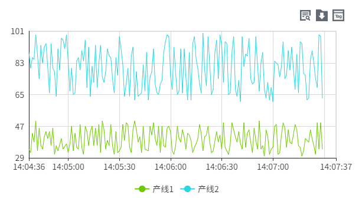

**属性**

| 名称 | 描述  |
|:----------|:----------------|
| 名字     | 此控件的名称。 |
| X        | 控件左侧距画布左侧的距离，单位px。  |
| Y        | 控件顶部距画布顶部的距离，单位px。  |
| W        | 控件的宽度，单位px。  |
| H        | 控件的高度，单位px。  |
| 时间范围 | 按照设置的时间段进行查询。  <br>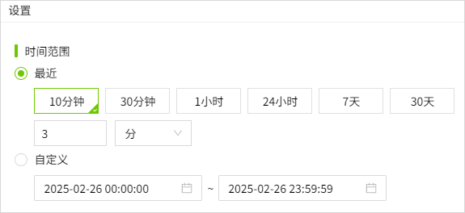  <br>- **最近**：设置数据展示的时间范围。<br>- **自定义**：设置开始时间和结束时间，自定义数据展示的时间范围。 |
| 查询方式 | 按照设置的查询方式进行查询。包含：原始值，固定点数，周期性。  <br>- 原始值：查询所选时间段内的所有原始历史数据。当选择原始值时，变量的聚合模式处于禁用状态。 <br>- 固定点数：需设置点数。表示将该时间范围按照设置的点数切分为对应的时间片，从每个时间片内按照设置的聚合模式筛选一笔数据。 <br>- 周期性：需设置周期。表示将该时间范围按照设置的周期切分为对应的时间片，从每个时间片内按照设置的聚合模式筛选一笔数据。|
| 数据     | 点击数据集按钮为历史趋势图设置数据来源及样式。  <br>  点击该按钮可以设置曲线的数据源和样式。<br>- **变量**：设置线条的数据来源。  点击变量栏最右侧的如下符号，可以将变量的路径直接复制到名称栏。  <br>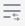 <br>- **名称**：设置线条名称。<br>- **Y轴**：选择一个Y轴，作为当前变量的Y轴。 <br>- **线条颜色**：设置线条的颜色。 <br>- **线条类型**：设置线条的类型。<br>- **线条样式**：设置线条的样式。 <br>- **线宽**：设置线条的粗细。 <br>- **区域填充**：设置线条和轴之间的区域背景色。 <br>- **报警线**：设置是否将变量的报警值作为一条直线显示在当前控件上。  <br>点击报警线的设置按钮，选择需要显示的报警线，并为其设置样式。  <br>勾选报警线的checkbox，用于在控件上启用报警线的显示。 <br>- **平均线**：设置是否将变量在查询时间段内的平均值作为一条直线显示在当前控件上。启用后可以设置平均线的线型。<br>- **平均线线宽**：设置平均线的线宽。   <br>- **标记样式**：设置线条连接点的样式。  <br>- **标记大小**：设置线条连接点的大小，单位px。 <br>- **小数位**：鼠标移到线条上所显示的数值的小数位数。 <br>- **聚合模式**：设置数据的聚合方式。当 **查询类型** 为 **固定点数** 和 **周期性** 时，该字段生效。 |
| 显示     | 设置按钮的显示、隐藏。 <br>- **选择变量按钮**：控制选择变量按钮的显示、隐藏。显示的情况下，在运行页面可以通过此按钮重新设置变量及其对应曲线的显示样式。 <br>- **导出按钮**：控制导出按钮的显示、隐藏。显示的情况下，在运行页面可以将查询到的数据进行导出。  <br>- **查询按钮**：控制查询按钮的显示、隐藏。显示的情况下，在运行页面可以重新设置查询的时间范围和方式。    |
| 按钮样式 | 设置按钮的颜色。  <br>- **选择变量按钮**：设置选择变量按钮的颜色。 <br>- **查询按钮**：设置查询按钮的颜色。  <br>- **导出按钮**：设置导出按钮的颜色。     |
| 颜色     | 设置控件的颜色效果。 <br>- **背景**：设置控件的整体背景色。 <br>- **栅格**：设置栅格的线条颜色。   <br>- **X轴**：设置X轴的轴线颜色。  |
| 边距     | 设置历史趋势图与其选中框之间的间距。确保图表能清晰显示，并为图表元素（如时间或图例）预留足够的空间。    |
| X轴      | 设置X轴的样式。 <br>- **显示栅格**：控制栅格的显示、隐藏。 <br>- **时间格式**：设置X轴显示的时间的格式,可以选择系统预置的时间格式，也可以手动输入，设置的时间格式须符合Echarts的时间格式要求，详见： [https://echarts.apache.org/zh/option.html#xAxis.axisLabel.formatter](https://echarts.apache.org/zh/option.html#xAxis.axisLabel.formatter)**(4.2.1及其以上版本，支持此功能)** <br>- **字体**：设置X轴显示的文字的字体、字体大小、粗体、斜体、字体颜色。  |
| Y轴      | 设置Y轴的样式。<br>- **显示栅格**：控制栅格的显示、隐藏。  <br>- **启用子图**：控制主图表中是否允许嵌入另一个图表。 <br>- **分度数**：设置在Y轴上插入的分割线数量。<br>- **轴**：显示轴的行列数。  <br>  点击该按钮可以设置轴的样式。<br>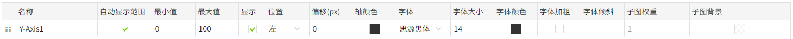  <br>- **名称**：Y轴的名称。<br>- **自动显示范围**：Y轴的量程根据值的范围动态变化。如果选中，则将自动确定Y轴的值范围。如果未选中，则将使用最小值和最大值。  <br>选择自动后，最小值和最大值变为失效状态。 <br>- **最小值**：Y轴的最小值。  <br>- **最大值**：Y轴的最大值。 <br>- **小数位**：设置Y轴的刻度值上显示的小数位数。 <br>- **显示**：设置Y轴的显示、隐藏。  <br>- **位置**：设置Y轴的位置。 <br>- **偏移**：设置Y轴相对于默认位置的偏移。 <br>- **轴颜色**：设置Y轴的颜色。  <br>- **字体**：设置Y轴坐标的字体。  <br>- **字体大小**：设置Y轴坐标的字体大小。   <br>- **字体颜色**：设置Y轴坐标的字体颜色。  <br>- **字体加粗**：设置Y轴坐标的字体粗细。  <br>- **字体倾斜**：设置Y轴坐标的字体倾斜。  <br>- **子图权重**：子图在主图表中所占的空间大小。 <br>- **子图背景**：设置子图的背景色。 |
| 图例     | 设置图例的样式。  <br>- **显示**：控制图例的显示、隐藏。默认显示。 <br>- **位置**：设置图例的显示位置。  <br>- **字体**：设置图例的字体、字体大小、粗体、斜体、字体颜色。 |
| 标记     | 设置是否在控件上显示最大点和最小点的标记。可以设置标记的样式，颜色和大小。   |
| 右键菜单 | 在控件上设置右键菜单，可以设置菜单的背景色、边框色、字体型号、字体大小、字体颜色、加粗、倾斜。可以为右键菜单配置对应的动作，包括：导航，变量赋值，属性赋值和执行脚本。  在运行许页面，在控件上单击鼠标右键，显示右键菜单。**(4.2.2及其以上版本，支持此功能)**    |

**说明**：历史趋势控件基于Echarts 5.x版本开发，该版本上分度数存在缺陷，不按设置的数值生效，导致历史趋势图也存在此问题。请等待Echarts修复该缺陷。

**动作**

允许您基于某种条件执行特定的动作。请参阅“[动作](../../event/index.md)”页上各种动作的完整描述。

**示例1**

使用历史趋势来显示电的使用情况。

1. 在画面上插入一个历史趋势图。
2. 设置历史趋势图的属性。

    | 属性 | 值  |
    |:----------|:----------------|
    | 时间范围 | 设置最近10分钟。   |
    | 查询方式 | 选择原始值。|
    | 值       | 绑定变量，设置曲线的样式。         点击进行数据源和样式设置。设置的属性值如下： <br>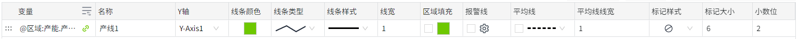       <br>- **变量**： @区域:产能.产线1 <br>- **名称**：产线1  <br>- **Y轴**：Y-Axis1   <br>- **线条颜色**：#6ec800  <br>- **线条类型**：折线   <br>- **线条样式**：实线   <br>- **线宽**：1    <br>- **区域填充**：未开启   <br>- **报警线**：未开启   <br>- **平均线**：未开启  <br>- **标记样式**：无   <br>- **标记大小**：6   <br>- **小数位**：2 |

3. 点击预览按钮进行预览。

    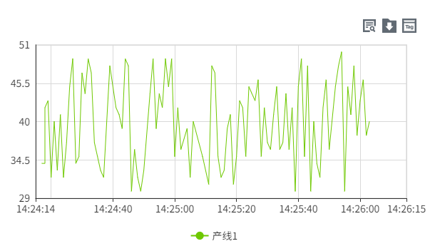

**示例2**

使用历史趋势来显示电的使用情况，在图上标识出电量的最大和最小值。

1. 在画面上插入一个历史趋势图。
2. 设置历史趋势图的属性。

    | 属性 | 值 |
    |:----------|:--------------|
    | 时间范围 | 设置最近10分钟。 |
    | 查询方式 | 选择原始值。 |
    | 值       | 绑定变量，设置曲线的样式。 <br>  点击进行数据源和样式设置。设置的属性值如下： <br> <br>- **变量**：@Demo:Totalpower <br>- **名称**：Totalpower    <br>- **Y轴**：Y-Axis1   <br>- **线条颜色**：#6ec800   <br>- **线条类型**：折线   <br>- **线条样式**：实线    <br>- **线宽**：1  <br>- **区域填充**：未启用  <br>- **报警线**：未启用   <br>- **平均线**：未启用   <br>- **标记样式**：无    <br>- **标记大小**：6   <br>- **小数位**：2    |
    | 标记     | 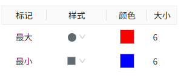 |

3. 点击预览按钮进行预览。

    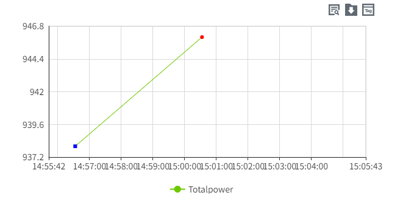

**示例3**

使用历史趋势来显示水温的变化情况，并可以在运行时随时添加水温参考线。

1. 在画面上插入一个历史时趋势图，并绑定变量: Demo:temperature
2. 配置一个添加参考线的弹窗：AddMarkLine，用于在运行页面在趋势图上添加参考线

    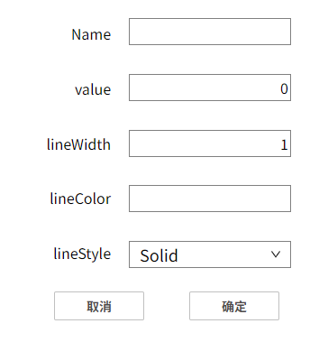

    点击“确定”按钮，在动作属性中设置 **按下** 动作脚本

    ```typescript

    const value = await System.Page.getPropertyValue('Value输入框1#value')
    const lineName = await System.Page.getPropertyValue('Name输入框1#text')
    const lineColor = await System.Page.getPropertyValue('Color输入框1#text')
    const lineStyle = await System.Page.getPropertyValue('Style下拉框1#selectedText')
    const lineWidth = await System.Page.getPropertyValue('Width输入框1#value')
    const model = {
        value: value,
        name: lineName,
        lineColor: lineColor,
        lineStyle: lineStyle,
        lineWidth: lineWidth
    };
    System.UI.close(model)
    ```
    
    点击“取消”按钮，在动作属性中设置 **按下** 动作脚本

    ```typescript
    System.UI.close()
    ```
 
3. 配置一个删除参考线的弹窗：DeleteMarkLine，用于在运行页面根据参考线的名称，在趋势图上删除参考线

    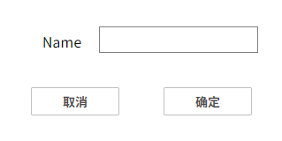

    点击“确定”按钮，在动作属性中设置 **按下** 动作脚本

    ```typescript
    const value = await System.Page.getPropertyValue('文本输入框1#text')
    System.UI.close(value)
    ```
    
    点击“取消”按钮，在动作属性中设置 **按下** 动作脚本

    ```typescript
    System.UI.close()
    ```
 
4. 在历史趋势图上配置右键菜单

    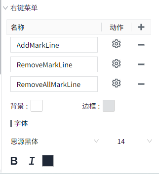

    AddMarkLine: 用于添加参考线

    RemoveMarkLine: 按照参考线名称，删除参考线;  如果不指定名称，则删除所有参考线。

    RemoveAllMarkLine: 删除所有参考线;  如果不指定名称，则删除所有参考线。

    在右键菜单中，点击AddMarkLine的动作按钮，在弹出的窗口中编写如下脚本：

    ```typescript
    const popup = await System.UI.openPopup('AddMarkLine')
    console.log(popup)
    if(!popup){
        return;
    }
    const chart = await System.UI.findControl('RealTimeChart1')
    chart.addMarkLine(popup);
    ```
    
    点击DeleteMarkLine的动作按钮，在弹出的窗口中编写如下脚本：

    ```typescript
    const popup = await System.UI.openPopup('RemoveLine')
    console.log(popup)
    if(!popup){
        return;
    }
    const chart = await System.UI.findControl('RealTimeChart1')
    chart.removeMarkLine(popup);
    ```
    
    点击DeleteAllMarkLine的动作按钮，在弹出的窗口中编写如下脚本：

    ```typescript
    const chart = await System.UI.findControl('RealTimeChart1')
    chart.removeMarkLine()
    ```
 
5. 在运行页面上，在趋势图上右击鼠标，点击AddMarkLine，弹出AddMarkLine弹窗，设置参考参考线样式后点击确定按钮，完成添加。

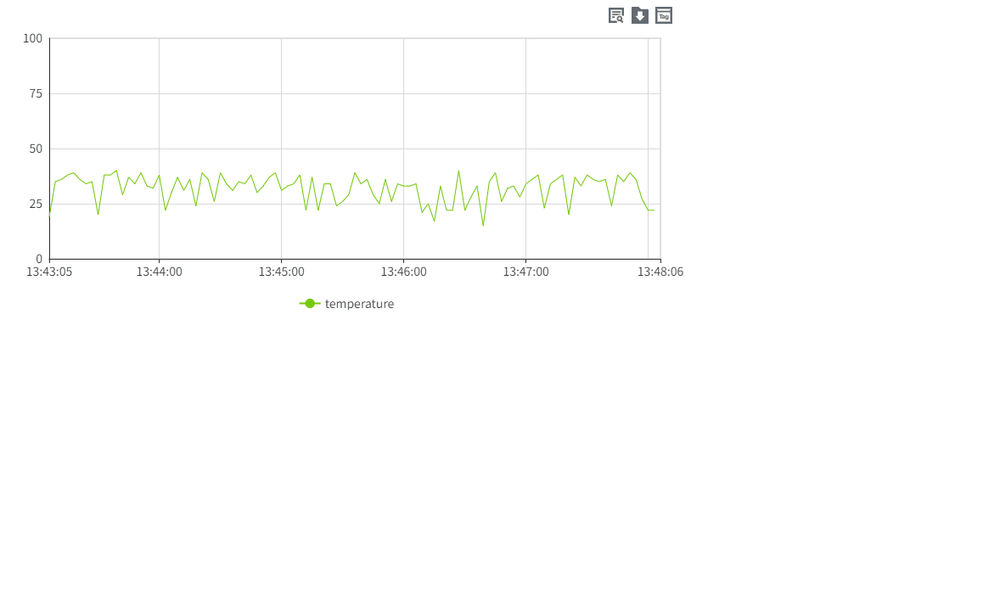

6. 在运行页面上，在趋势图上右击鼠标，点击DeleteMarkLine，输入要删除的参考线的名称，删除该参考线。

    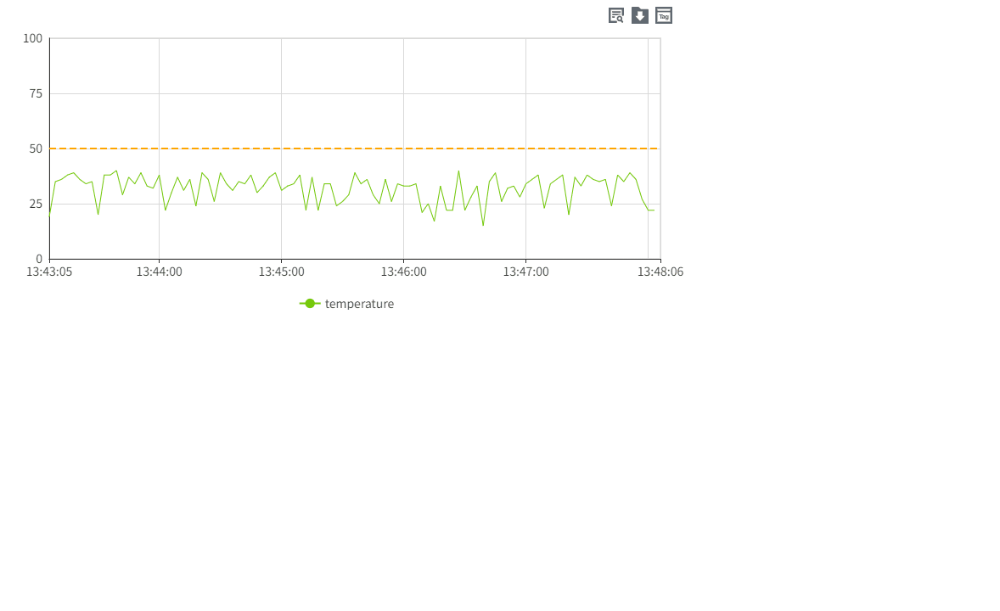

7. 在运行页面上，在趋势图上右击鼠标，点击DeleteAllMarkLine，删除所有添加的参考线。

    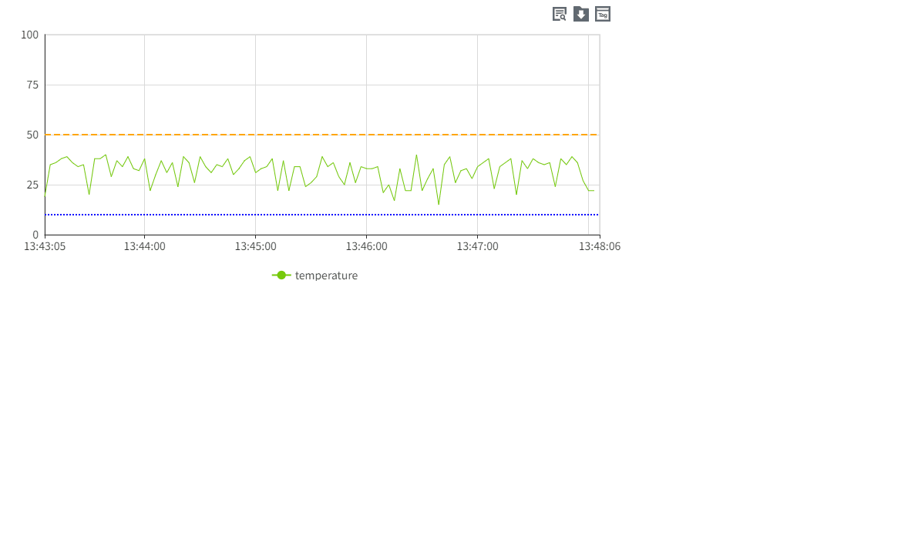