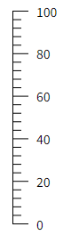
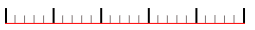
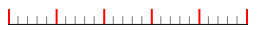
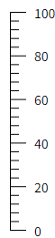
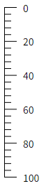
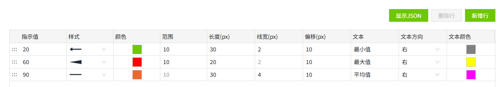
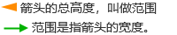
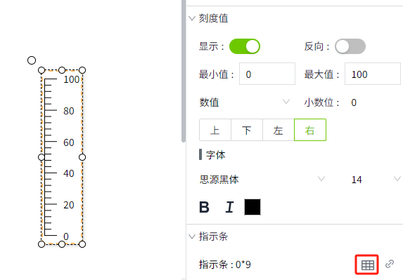
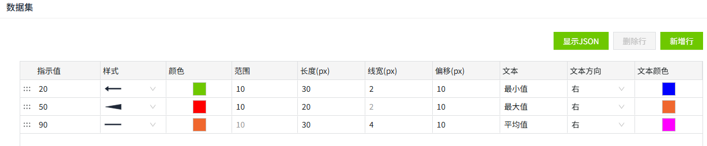
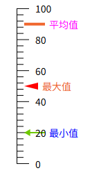

# 刻度尺

刻度尺用于测量和标记长度。

**属性**

| 名称 | 描述 |
|:--------------------|:----------------|
| 名字   | 此控件的名称。  |
| X  | 控件左侧距画布左侧的距离，单位px。 |
| Y   | 控件顶部距画布顶部的距离，单位px。  |
| W   | 控件的宽度，单位px。  |
| H  | 控件的高度，单位px。   |
| | 控件的角度。 |
| 填充  | 控件的背景色。   |
| 刻度    | 设置刻度的外观样式。    - **轴**：设置刻度尺主轴颜色和粗细。下图的红色区域为主轴。    - **主刻度**：设置刻度尺主刻度颜色，粗细，数量和长度。下图的红色区域为主刻度。     - **副刻度**：设置刻度尺副刻度颜色，粗细，数量和长度。下图的红色区域为副刻度。    |
| 刻度值   | 设置刻度尺的测量范围。   - **显示**：是否显示刻度值。  - **反向**：将刻度值的最大值和最小值反向显示。   反向前：        反向后：    - **最大值**：刻度尺的最大值      - **最小值**：刻度尺的最小值  - **数值类型**：包含数值和百分比，用于设置刻度值的数值类型。  - **小数位**：设置刻度值的小数位数。 - **字体**：设置刻度值的字体类型，字体大小，加粗，倾斜和字体颜色。 |
| 指示条   | 设置刻度尺上各指示条的样式。样式包含箭头，直线和楔形。  点击设置按钮，在窗口中设置指示条及其样式。    - **指示值**：指示条对应的值  - **样式**：选择指示条的样式，包含箭头，直线和楔形。 - **颜色**：设置指示条的颜色。  - **范围**：选择直线时，范围无效，禁用。    - **长度**：指示条的整体长度。  - **线宽**：选择楔形时，范围无效，禁用。  选择直线和箭头时，表示线段的宽度。 - **偏移**：设置指示器与轴之间的距离。  - **文本**：可以为指示条设置文本描述。   - **文本方向**：设置文本的内容显示方向。  - **文本颜色**：设置文本内容的字体颜色。 |

**动作**

允许您基于某种条件执行特定的动作。请参阅“[动作](../../event/index.md)”页上各种动作的完整描述。

**示例**

在刻度尺上添加3个指示条，分别表示最大值，最小值和平均值。

1. 在画面上插入一个刻度尺控件
2. 点击该控件，在控件的外观属性中点击指示条的数据集按钮

    

3. 在数据集弹窗中进行如下设置

    

4. 保存弹窗后，刻度尺显示效果如下：

    

