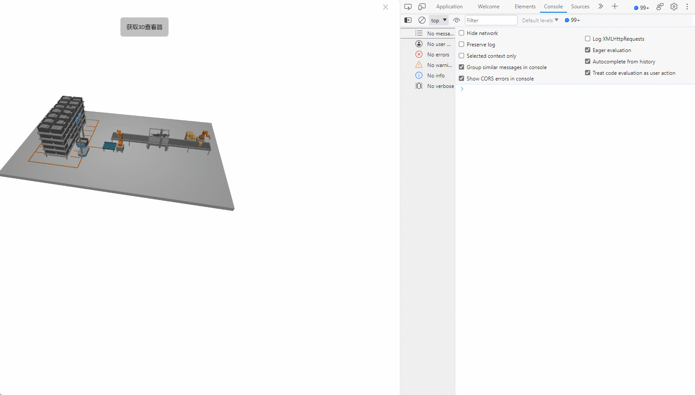
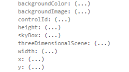
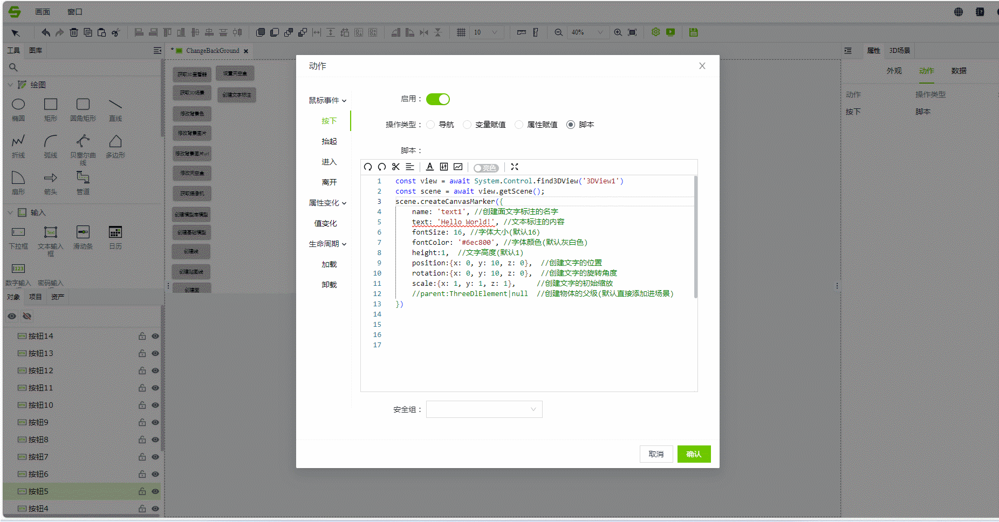

# find 3DView

**描述：** 获取画面中的3D查看器

```typescript
const view = await System.UI.findControl('3D查看器1');  // 获取画面中名为“3D查看器1”的3D查看器控件
console.log(view); // 控制台输出查询到的3D查看器控件
```
 
**实例：**

在按钮按上编写上述代码，点击按钮，可以在控制台看到3D场景的属性和方法。





Tips:查看API的参数信息




