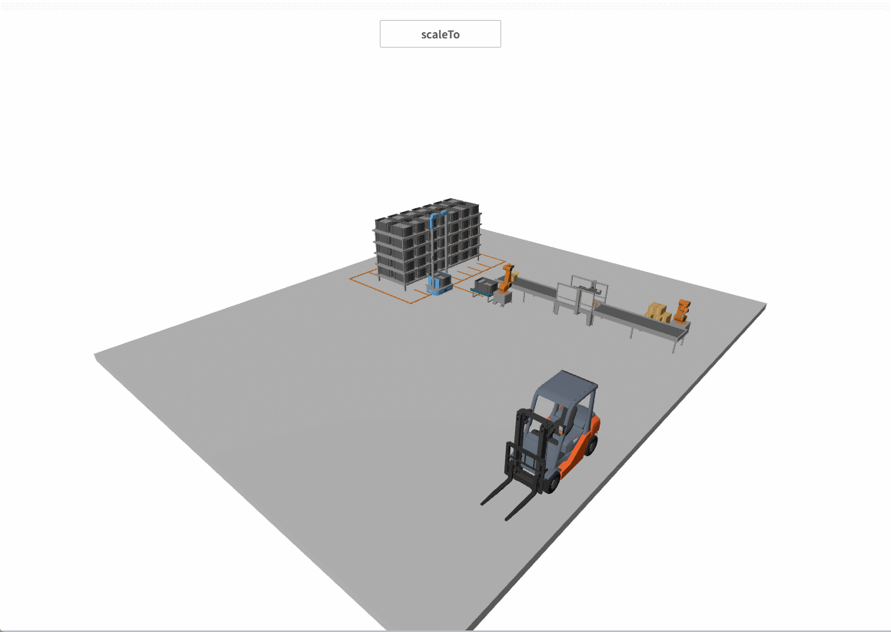

# scaleTo

**描述：模型放大缩小动画**

```typescript
const view = await System.UI.findControl('3D查看器1');// 获取画面中名为“3D查看器1”的3D查看器控件
const scene = await view.getScene(); // 获取3D查看器控件中的场景
const mesh = await scene.findMesh({ name: 'Forklift' });
const meshScale = mesh.scale;
mesh.scaleTo({
    scale: { x: meshScale.x + 5, y: meshScale.y + 5, z: meshScale.z + 5 }, // 模型最终缩放值
    duration: 1000, // 动画持续时间
    delay: 100, // 动画开始延迟时间
    executions: 1, // 动画执行次数
    reversePlay: false, // 是否反向播放
    resetOnComplete: false // 动画结束之后是否需要回到初始位置
});
```

**示例：**

在按钮上编写上述代码，点击按钮，可以播放模型放大动画。

