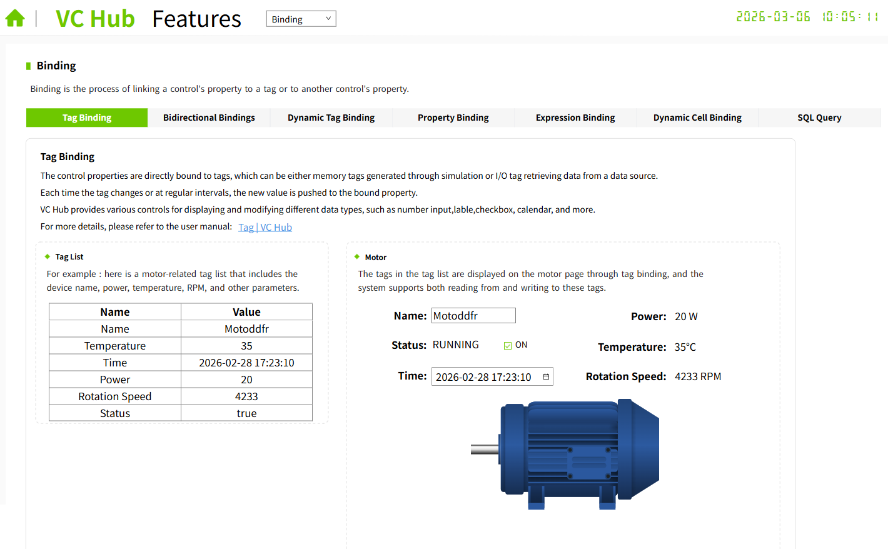
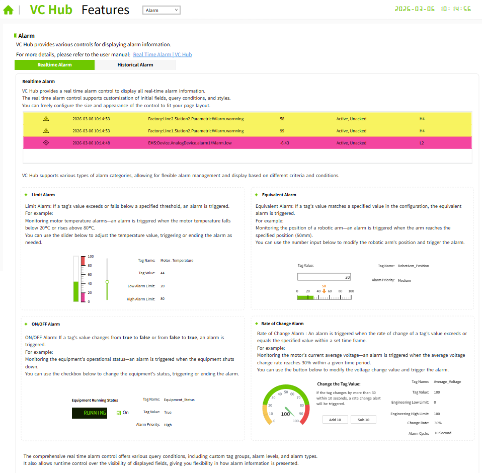
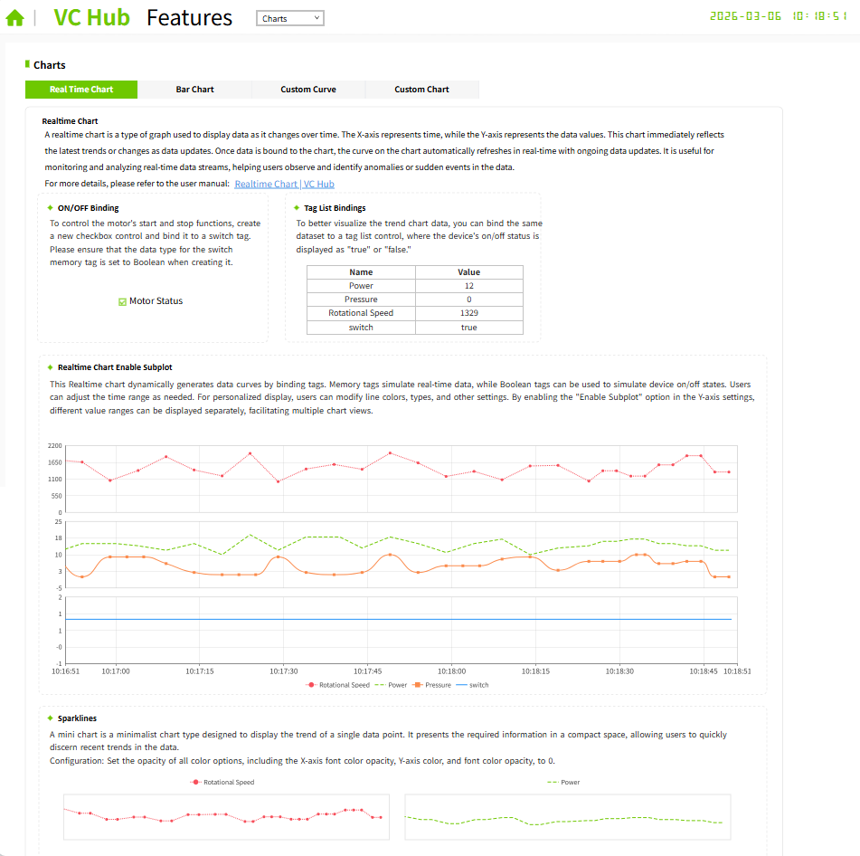
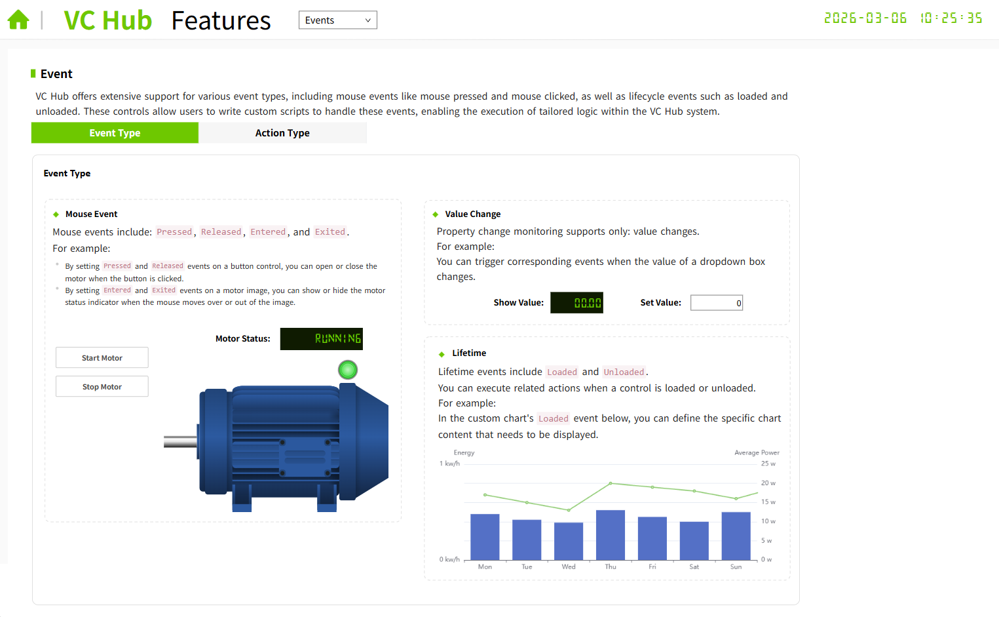
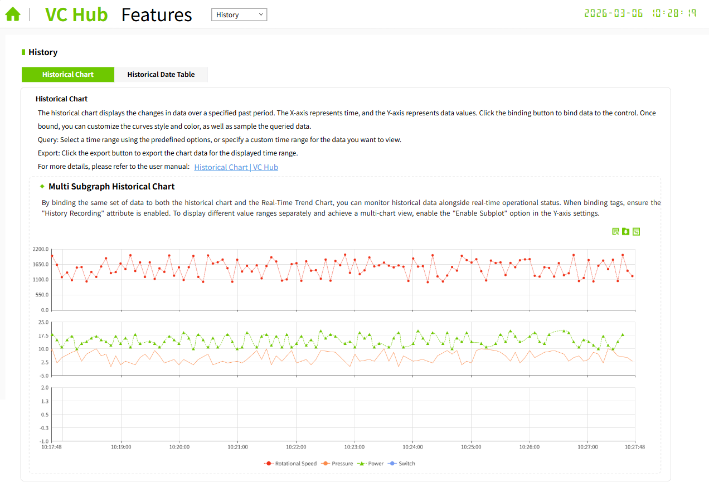
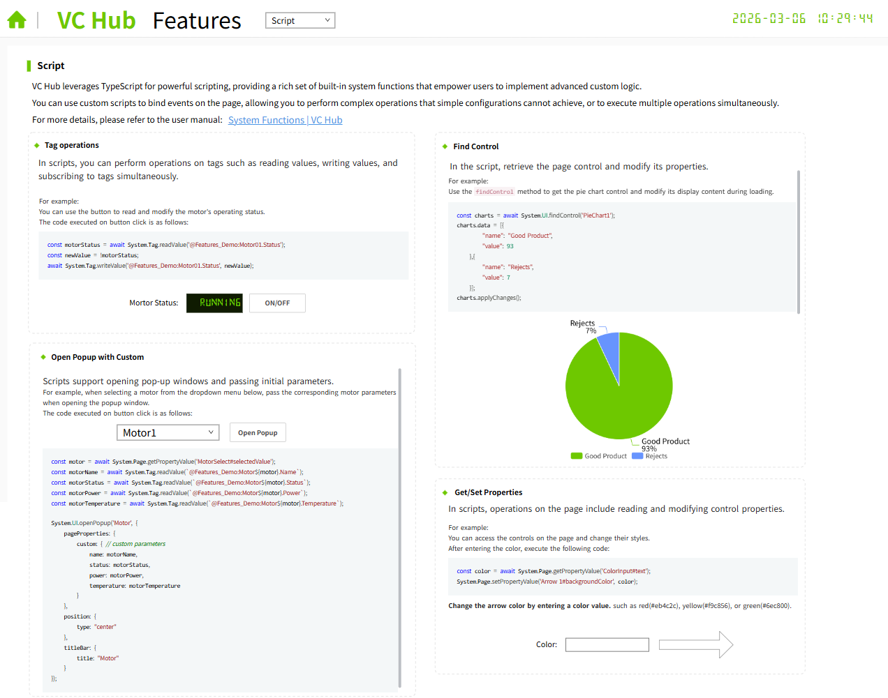
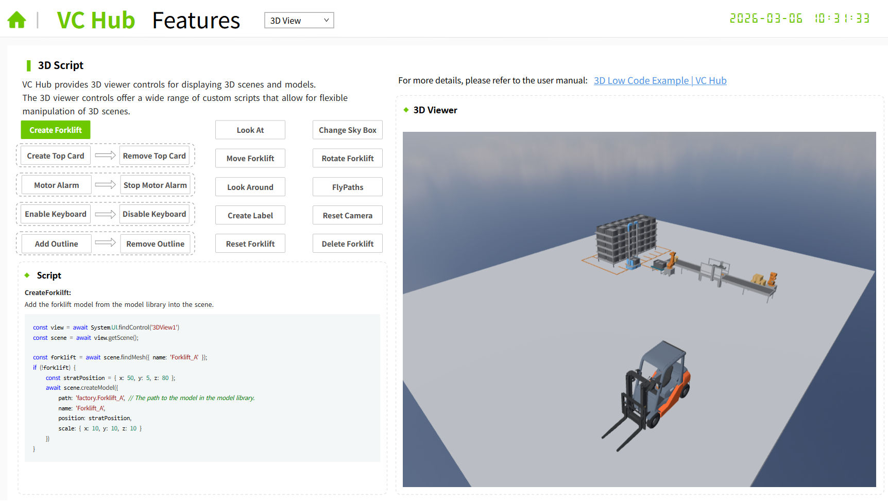
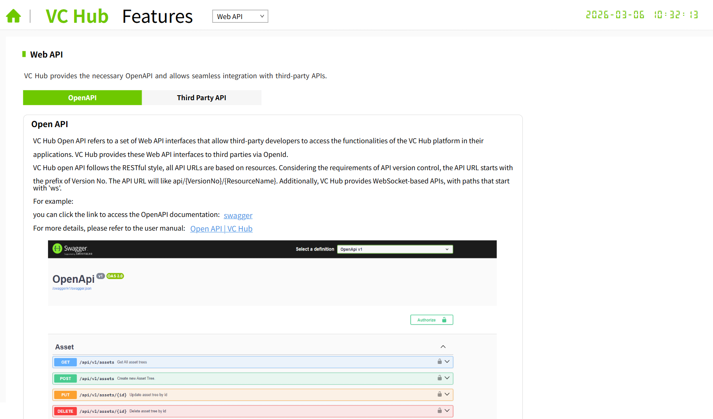

# Features

**描述：此项目用于介绍 WAGO SCADA 的各种核心功能。**

您可以点击该项目的“设计”按钮，在编辑器中点击“打开画面”，查看各个画面。

### Binding

介绍WAGO SCADA的4种属性绑定。在Home项目的运行页面上，点击Binding图标，显示的即为此画面。

### Alarm

介绍WAGO SCADA的报警功能。在Home项目的运行页面上，点击Alarm图标，显示的即为此画面。

### Charts

介绍WAGO SCADA的图表控件。在Home项目的运行页面上，点击Charts图标，显示的即为此画面。

### Events

介绍WAGO SCADA的动作功能。在Home项目的运行页面上，点击Events图标，显示的即为此画面。

### History

介绍WAGO SCADA的历史数据功能。在Home项目的运行页面上，点击History图标，显示的即为此画面。

### Script

介绍WAGO SCADA的脚本功能。在Home项目的运行页面上，点击Script图标，显示的即为此画面。

### 3D View

介绍WAGO SCADA的3D功能。在Home项目的运行页面上，点击3D View图标，显示的即为此画面。

### Web API

介绍WAGO SCADA的Web API功能。在Home项目的运行页面上，点击Web API图标，显示的即为此画面。

