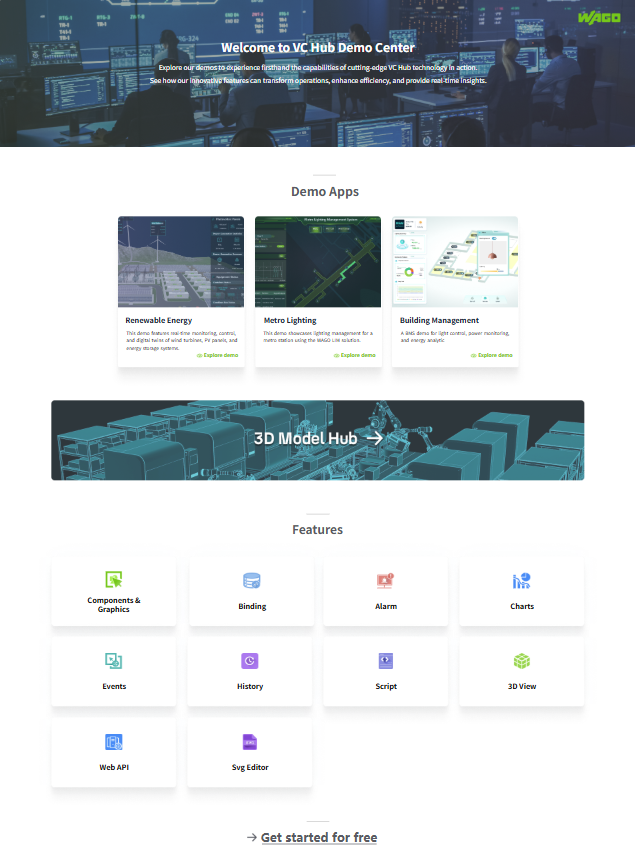

# Home

**描述：此项目是所有 demo 画面的入口项目。通过 Home 项目可以快速查看 WAGO SCADA 的各个核心模块的功能介绍。**

在项目列表中，点击 Home 项目的运行按钮，显示如下画面：

点击 Features 中的各个模块，打开对应画面。

- Components & Graphics:  点击后显示项目“Components”的运行画面，具体可查阅 [Components](components.md)。
- Binding: 点击后显示属性绑定介绍页面，该页面来源于项目“Features”的Binding画面，具体可查阅 [Features](features.md)。
- Alarm: 点击后显示报警介绍页面，该页面来源于项目“Features”的Alarm画面，具体可查阅 [Features](features.md)。
- Charts: 点击后显示图表介绍页面，该页面来源于项目“Features”的Charts画面，具体可查阅 [Features](features.md)。
- Events: 点击后显示动作介绍页面，该页面来源于项目“Features”的Charts画面，具体可查阅 [Features](features.md)。
- History: 点击后显示历史数据介绍页面，该页面来源于项目“Features”的History画面，具体可查阅 [Features](features.md)。
- Script: 点击后显示脚本介绍页面，该页面来源于项目“Features”的Script画面，具体可查阅 [Features](features.md)。
- 3D View: 点击后显示3D介绍页面，该页面来源于项目“Features”的3D View画面，具体可查阅 [Features](features.md)。
- Web API: 点击后显示Web API介绍页面，该页面来源于项目“Features”的Web API画面，具体可查阅 [Features](features.md)。

点击底部的“**Get started for free**”，跳转至 WAGO SCADA 官网的“软件下载”页面。

