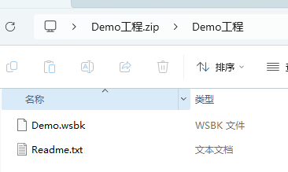
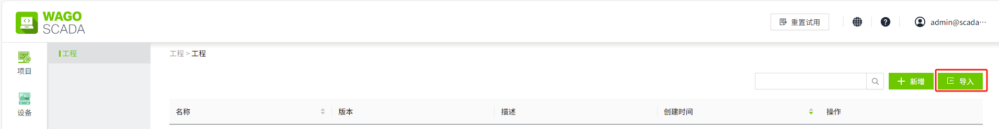
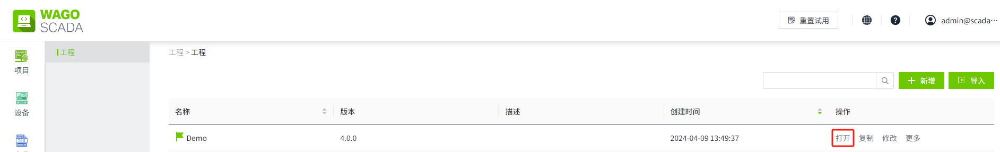

# Demo工程

Demo 工程旨在演示 WAGO SCADA 的各种功能、操作流程和界面布局。通过 Demo，用户可以了解和学习如何进行配置、监控和控制画面，从而在实际应用中更加高效地利用组态软件。

### 下载Demo工程

您可以在我们的官网上 [https://www.wagoscada.cn](https://www.wagoscada.cn)，进入软件下载页面，下载 Demo 工程。该 Demo 用于展示 WAGO SCADA 中各种控件的运行效果。

### 导入Demo工程

1. 安装 WAGO SCADA
2. 解压已下载的Demo工程文件

    

3. 解压后，在工程列表页面，点击 **导入** 按钮，导入 Demo.wsbk 文件

    

### 查看Demo工程

1. 点击工程列表中，Demo工程后面的 **打开** 按钮。

    

    跳转至登录页面。

    

2. 查看解压后的 **Readme.txt** 文件。文件中写明了登录 Demo 工程所需的初始 **用户名** 和 **密码**。
3. 使用步骤2的用户名和密码，登录系统。
4. 在项目列表页面，点击项目的运行按钮进行查看。
5. Demo工程包含3个项目:[Home](home.md), [Components](components.md), [Features](features.md)。

