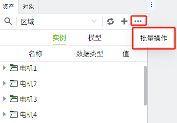
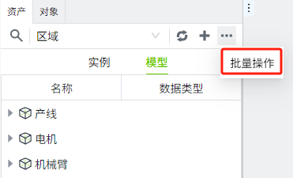
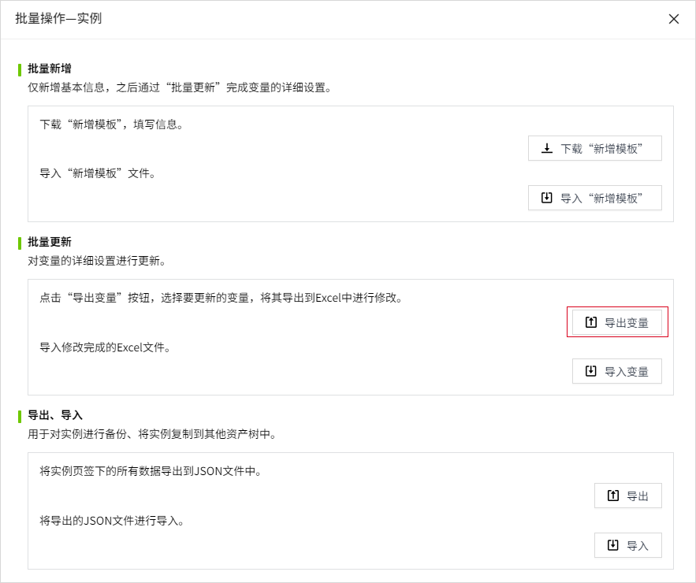
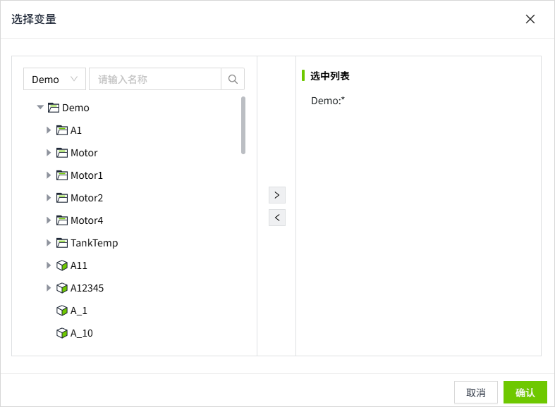
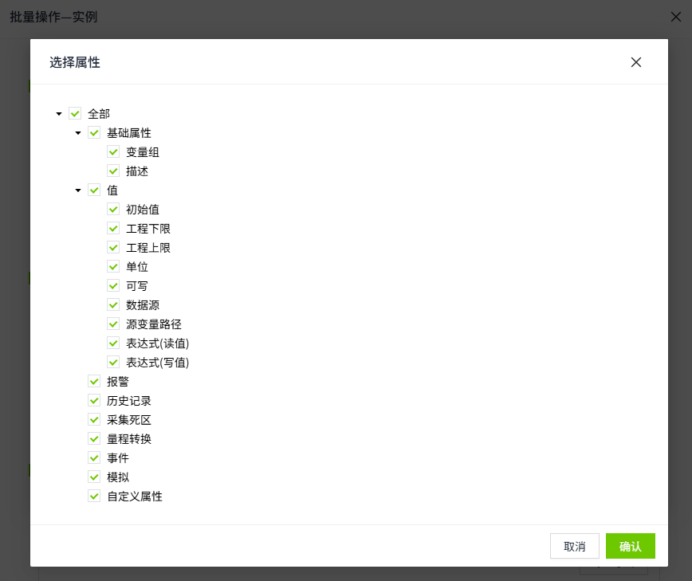
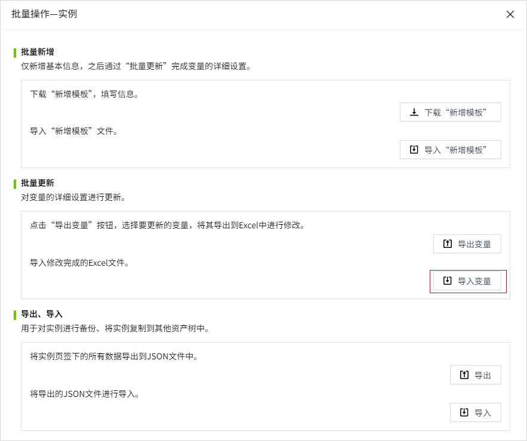

# 批量更新

在模型或者实例页面下，批量创建数据后，可以对变量的详细设置进行更新。例如变量的报警配置、变量绑定的数据源路径等。

## 导出变量

1. 在模型或实例的批量操作窗口中，点击“批量操作”按钮。

    

    

2. 在批量操作弹窗中，点击”导出变量“按钮。

    

3. 点击后，会弹出变量选择器，将需要导出的变量加入到”选中列表“。如果选择的是目录或者实例，则表示选中该目录或实例节点（包含当前节点及其所有子节点）下的所有变量。目录和实例选中后，以*表示其下所有变量。

    

4. 点击”确认“按钮，弹出属性选择窗口，可以选择需要的变量属性进行导出。导出文件为excel格式。

    

## 导入变量

导出的变量文件修改完成后，在批量操作弹窗中，点击”导入变量“按钮，将变量导入。

**注意：**

- 该操作会通过Excel中的路径列的数据匹配资产中的变量，覆盖变量的配置，不支持新增和删除；
- 不需要更新的配置，可在Excel中删除对应列，或者将对应的列的值设置为空；
- 由模型引用过来的变量，在进行导入变量配置操作时，会对修改的配置进行重写。

