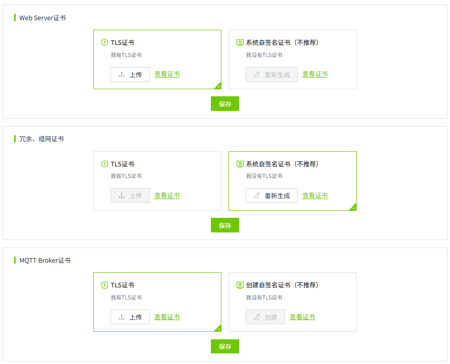
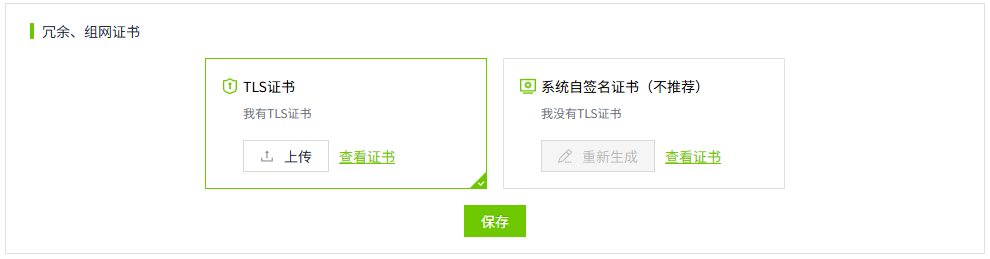
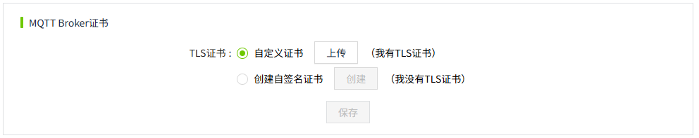
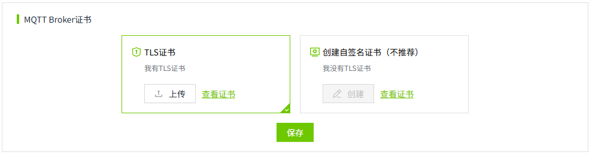

# 证书管理

用来统一管理证书。每类证书独立保存。包含：

- **Web Server证书**：用于配置 Web 客户端（如浏览器）与 SCADA 服务器之间安全通信的证书。
- **冗余、组网证书**：用于配置多个 SCADA 节点在冗余或组网模式下安全通信的证书。
- **MQTT Broker证书**：用于配置 MQTT 客户端（如现场设备或 SCADA 客户端）与 MQTT Broker 之间安全通信的证书。

## Web Server证书

默认选择TLS证书。

- 如果用户有TLS证书，可以点击TLS证书的”上传“按钮，上传一个TLS证书。
- 如果用户没有TLS证书，可以选择”系统自签名证书“。使用系统自带的证书进行通信。点击”重新生成“按钮，将重新生成一张自签名证书。

证书设置完成后，可以点击“查看证书“按钮，查看证书的详细信息。

## 冗余、组网证书

默认选择TLS证书。

- 如果用户有TLS证书，可以点击TLS证书的“上传”按钮，上传一个TLS证书。
- 如果用户没有TLS证书，可以选择“系统自签名证书”。使用系统自带的证书进行通信。点击“重新生成”按钮，将重新生成一张自签名证书。

证书设置完成后，可以点击“查看证书”按钮，查看证书的详细信息。

**说明**：在进行冗余或者组网配置前，要先在此处为其设置证书。

## MQTT Broker证书

默认选择TLS证书。

- 如果用户有TLS证书，可以点击TLS证书的“上传”按钮，上传一个TLS证书。
- 如果用户没有TLS证书，可以选择“创建自签名证书”。系统内置了一个自签名证书，您也可以点击“创建”按钮，重新创建一张自签名证书。

证书设置完成后，可以点击“查看证书”按钮，查看证书的详细信息。

**说明**：在为MQTT Broker启用TLS前，要先在此处为其设置证书。