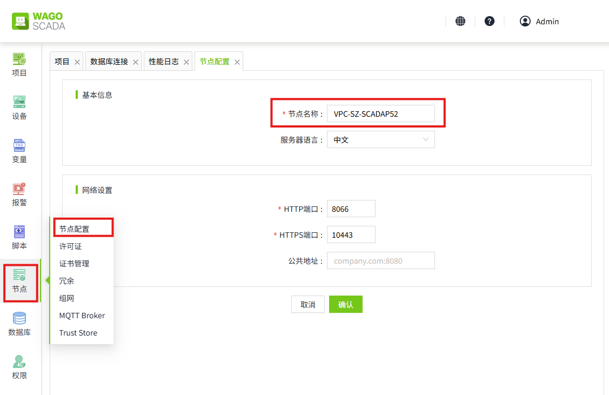
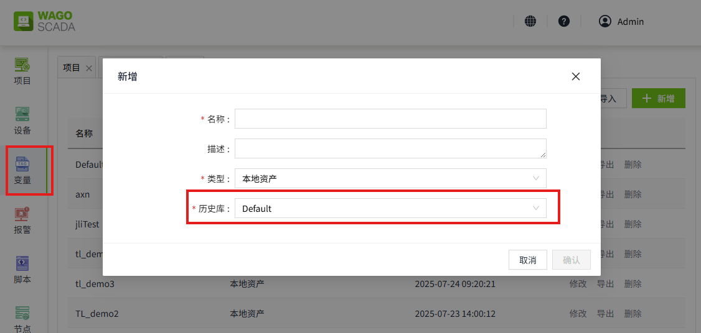
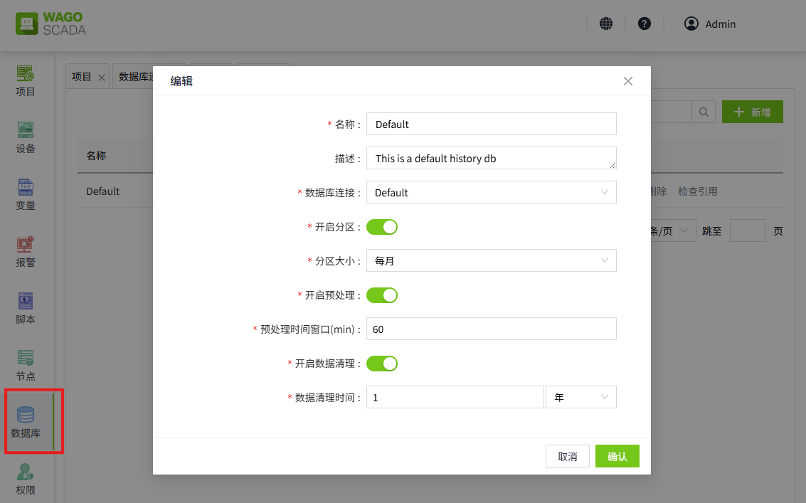
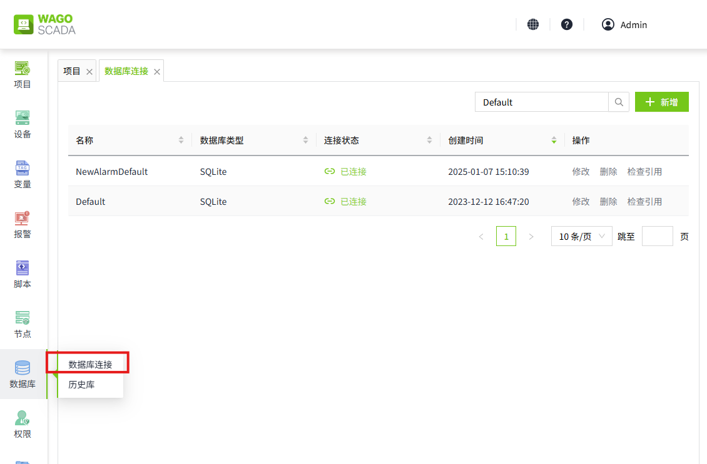

# 数据库表结构参考

SCADA内置了许多系统，可以自动查询数据，而无需您手动构建查询和表结构。这些系统会自动在数据库中创建必要的表，插入相关数据，并提供相关查询方法。由于历史数据都存储在数据库表中，因此可以手动访问并查询数据，以自定义您查看数据的方式。

这些表都具有特定的结构，贸然更改表结构可能会导致不可预见的问题，因此不建议您对表结构进行更改和删除。

虽然可以直接手动查询相关表数据，但是我们建议您在进行更改或操作之间备份数据库。并了解更改数据或表结构的风险将由您自行承担。

由于SCADA系统支持传统的关系型数据库，也支持时序数据库InfluxDB，所以争对不同类型的数据库，表结构定义也有所差别。

关系型数据库共享同一套的表结构定义，InlfuxDB单独一套表结构定义。   

## 介绍

在介绍表结构之前，我们需要先了解相关基础配置。

## 节点

在 SCADA 程序中，有个节点配置功能，节点名称默认采用服务器主机名，用户可以更改为其他名称。节点主要是起唯一标识作用，方便组网中的其他 SCADA 程序识别。历史库存储数据时也会记录当前存储数据节点名称。

## 资产

在 "变量->资产" 页面，我们可以配置变量的历史存储库，当该变量开启历史记录时，会将变量的历史数据存入对应的历史库中。

## 历史库

在 "数据库->历史库"页面，我们可以配置变量历史的存储介质和存储形式。

## 数据库连接

目前 SCADA 系统支持 MySQL、SQLServer、PostgreSQL、SQLite、InfluxDB 共 5 种数据库类型，在数据库连接中配置对应数据库的连接地址、账号等信息，并提供给报警历史或变量历史使用。

