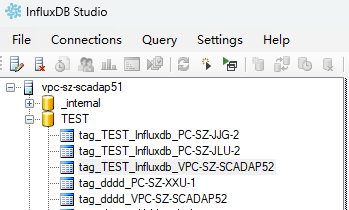

# InfluxDB表结构

InflxuDB由于其与传统的关系型数据库结构不一致，所以其表结构的组成或概念也有所不同

## **Measurement结构** 说明

在配置InlfuxDB的数据库连接并在历史库中使用后，当变量开启历史数据时，会向InflxuDB写入数据。SCADA系统内部会自动的创建相关 **Measurement**

## **tag_{HistoryDatabaseName}_{NodeName}**

变量历史库的Measurement名称以 **tag_** 开头，其中HistoryDatabaseName 是该变量绑定的资产所配置历史库的历史库名称，NodeName是该历史数据产生的节点的节点名称  

例如变量名称为 **HistoryAsset:Device.record，** 这个变量所绑定的资产名称是 **HistoryAsset，** 查看HistoryAsset所配置的历史库，这个历史库名称假设为 **InfluxDbHisotry**，SCADA系统的节点名称为 **PC-SZ-JJG，** 那么在InlfuxDb中 **Measurement** 的名称就是 **tag_InfluxDbHisotry_PC-SZ-JJG**

| 列名称 | 列类型 | 值类型  | 说明 |
|:--------|:--------|:---------|:----------|
| P      | Tag    | string  | 变量名称 |
| T      | Tag    | string  | 值类型的数字字符串   1: Integer   2: String   3: Double   4: Boolean   5: DateTime    |
| Q      | Field  | Integer | 质量位   |
| IV     | Field  | Integer | 当T="1"时，该列存储对应值，否则为Null  |
| DV     | Field  | float   | 当T="3"时，该列存储对应值，否则为Null  |
| BV     | Field  | boolean | 当T="4"时，该列存储对应值，否则为Null   |
| BIV    | Field  | integer | 当T="4"时，该列存储对应值 true存1 false存0，否则为Null   |
| DTV    | Field  | string  | 当T="5"时，该列存储对应值    会将时间转换为UTC时间后，按照`yyyy-MM-ddTHH:mm:ss.fffZ`格式化为字符串存入，否则为Null |
| SV     | Field  | string  | 当T="2"时，该列存储对应值，否则为Null    |

