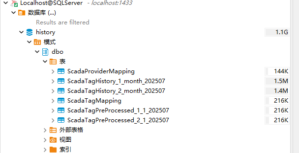

# 关系型数据库表结构说明

SQLite、SQLServer、PostgreSQL、MySQL这4种传统关系型数据库共享同一套表结构定义   

## 边历史库

变量历史库在数据库中至少使用3种不同的表

| 表名称 | 表说明 | 列引用 |
|:-------------------|:----------------|:-----------|
| ScadaProviderMapping    | 历史数据来源节点和历史库名称的注册表，用于标识历史数据来源 | ScadaTagMapping.ProviderId = ScadaProviderMapping.Id  ScadaTagHistory.ProviderId = ScadaProviderMapping.Id  ScadaTagHistory_X_X_X.ProviderId = ScadaProviderMapping.Id |
| ScadaTagMapping   | 历史数据变量和变量值类型注册表，用于注册变量和提供变量Id | ScadaTagHistory.TagId = ScadaTagMapping.Id  ScadaTagHistory_X_X_X.TagId = ScadaTagMapping.Id   |
| ScadaTagHistory   | 此表存储原始变量历史数据，当历史库配置选择不分区时，数据存储到此表  |  |
| ScadaTagHistory_{**ProvideId**}_{**PartitonSize**}_{**DateKey**} | 此表存储原始变量历史数据，当历史库配置选择分区时，数据存储到此表  将有多个表适合此格式，具体取决于  **ProviderId** **历史数据来源**(ScadaProviderMapping.Id)  **PartitonSize 历史库分区大小**(day、week、month、quarter、halfyear、year)  **DateKey 时间分区键**(根据当前时间和分区大小计算出的分区键)，例如：   Day: 历史数据产生日期的yyyyMMdd格式 20250731   Week: 历史数据产生日期是当前年的第几周 202512   Month: 历史数据产生日期的yyyyMM格式 202507   Quarter: 历史数据产生日期是当前年的第几季度 202503   HalfYear: 历史数据产生日期是当前年的第几个半年 202502   Year: 史数据产生日期的yyyy格式 2025 |  |
| ScadaTagPreProcessed_{**ProvideId**}_{**WindowSize**}_{**DateKey**} | 此表存储着预处理数据，当历史库配置开启预处理时，会将原始数据按照预处理配置存储到此表中   将有多个表适合此格式，具体取决于  **ProviderId** **历史数据来源**(ScadaProviderMapping.Id)  **WindowSize 预处理时间窗口(历史库配置)**  **DateKey 时间分区键(根据原始数据时间按照yyyyMM分组)**  | |

## ScadaProviderMapping

变量会绑定资产，资产会绑定历史库，历史库名称和当前历史数据来源的节点的节点名称构成了此表

历史数据来源节点的节点名称和历史库名称的注册表，用于标识历史数据来源。

| 列名称   | 数据类型 | 描述|
|:----------|:----------|:-----------------|
| Id       | BigInt   | 自增 Id。被表 **ScadaTagMapping**、**ScadaTagHistory**、**ScadaTagHistory_X_X_X** 所引用 |
| Node     | String   | 数据来源节点的节点名称       |
| Provider | String   | 资产绑定的历史库的历史库名称或报警历史库名称  |

## ScadaTagMapping

历史数据变量和变量值类型注册表，用于注册变量和提供变量Id

| 列名称         | 数据类型 | 描述     |
|:----------------|:----------|:---------------|
| Id             | BigInt   | 自增 Id，被表 **ScadaTagHistory**、**ScadaTagHistory_X_X_X** 所引用           |
| Tag            | String   | 变量名称      |
| Type           | TinyInt  | 变量存储的数据类型  1: Integer 2: String 3: Double 4: Boolean 5: DateTime |
| ProviderId     | BigInt   | 来源 ScadaProviderMapping 的 Id   |
| NormalizedName | String   | 变量转中文拼音后的字符串     |

## **ScadaTagHistory Or ScadaTagHistory**_{**ProvideId**}_{**PartitonSize**}_{**DateKey**}

存储原始变量历史数据

当历史库配置关闭分区时，数据存储到 **ScadaTagHistory**

当历史库配置开启分区时，数据存储到存储到 **ScadaTagHistory**_{**ProvideId**}_{**PartitonSize**}_{**DateKey**}**

| 列名称      | 数据类型 | 描述  |
|:-------------|:----------|:--------------|
| TagId       | BigInt   | 来源 ScadaTagMapping 的 Id                             |
| ProviderId  | BigInt   | 来源 ScadaProviderMapping 的 Id                        |
| Quality     | Int      | 质量位                                                 |
| IntegerVal  | BigInt   | 如果变量的数据类型是Integer，则保存变量的值，否则为Null  |
| DoubleVal   | Double   | 如果变量的数据类型是Double，则保存变量的值，否则为Null   |
| BoolVal     | Boolean  | 如果变量的数据类型是Boolean，则保存变量的值，否则为Null  |
| StringVal   | String   | 如果变量的数据类型是String，则保存变量的值，否则为Null   |
| DateTimeVal | DateTime | 如果变量的数据类型是DateTime，则保存变量的值，否则为Null |
| Timestamp   | BigInt   | 变量值记录时的时间戳(毫秒)                             |

## **ScadaTagPreProcessed_**{**ProvideId**}_{**WindowSize**}_{**DateKey**}

当历史库开启预处理时，会对原始数据表 **ScadaTagHistory** Or **ScadaTagHistory**_{**ProvideId**}_{**PartitonSize**}_{**DateKey**}的原始数据进行预处理

根据预处理配置的时间窗口和时间，以及历史数据来源，创建对应的预处理表 **ScadaTagPreProcessed**_{**provideId**}_{**WindowSize**}_{**DateKey**}   

| 列名称           | 数据类型 | 描述 |
|:------------------|:----------|:----------|
| TagId            | BigInt   | 来源 ScadaTagMapping 的 Id  |
| Category         | Int      | **采样类型**  1: Min  2: Max  3: Avg(IntegerVal 列存储的是 Count，Double 列存储的是 Avg 值)  4: Last  5: First  7: Count  11: CountOn And CountOff(IntegerVal 列存储的是 CountOn 值，Double 列存储的是 CountOff 值)  12: DurationOn And DurationOff(IntegerVal 列存储的是 DurationOn 值，Double 列存储的是 DurationOff 值)              |
| Timestamp        | BigInt   | 预处理数据对应时间  例如预处理时间为 2 分钟  那么 Tag 值存储时间除以 2*60*2000 取整，之后乘以 2*60*2000 得到的值 为 Timestame 值   例如预处理采样时间窗口为2分钟：   那么`2028-08-01 01:00:00 ~ 2028-08-01 01:02:00`之间的原始数据统计的时间就是`2028-08-01 01:00:00`，然后转换为时间戳                                             |
| Quality          | Int      | 质量位 |
| IntegerVal       | BigInt   | - 如果变量的数据类型是Integer，则保存变量的值，否则为`Null`   - 当采样类型为`Avg`时，此列存储的时这个采样区间该变量原始数据的数量   - 当采样类型为`Count`时，此列存储的时这个采样区间该变量原始数据的数量   - 当采样类型为`CountOn And CountOff`时，此列存储的是CountOn的值   - 当采样类型为`DurationOn And DurationOff`时，此列存储的是DurationOn的值 |
| DoubleVal        | Double   |- 如果变量的数据类型是Double，则保存变量的值，否则为`Null`   - 当采样类型为`Avg`时，此列存储的时这个采样区间该变量原始数据的平均值   - 当采样类型为`CountOn And CountOff`时，此列存储的是**CountOff的值   - 当采样类型为`DurationOn And DurationOf`f时，此列存储的是DurationOff的值   |
| BoolVal          | Boolean  | 如果变量的数据类型是4 Boolean，则保存变量的值，否则为`Null` |
| StringVal        | String   | 如果变量的数据类型是2 String，则保存变量的值，否则为`Null`|
| DateTimeVal      | DateTime | 如果变量的数据类型是5 DateTime，则保存变量的值，否则为`Null` |
| CollectTimestamp | BigInt   | 当前采样类型数据来源的记录时间(如无采用 Timestamp 相同值) |

## 说明

#### ProviderId

`ScadaProviderMapping`的主键Id，在`ScadaTagHistory，ScadaTagMapping`等表中表现为`ProviderId`

#### WindowSize

历史库配置的预处理时间窗口的值，表示预处理的采样周期

#### Datekey

根据历史数据的原始数据的时间，结合分区类型计算出的分区Key

| 分区类型 | 计算逻辑  |
|:----------|:-----------|
| day      | 历史数据变量值记录 UTC 时间  按 `yyyyMMdd` 格式化  例: 20241105   |
| week     | 历史数据变量值记录 UTC 时间  按照星期一作为每周起始。从每年的 1 月 1 日开始计算周排序(排序索引从 1 开始)  例: 202445 |
| month    | 历史数据变量值记录 UTC 时间  `yyyyMM`  例: 202411   |
| quarter  | 历史数据变量值记录 UTC 时间  按 `yyyy`{季度按照 1~4}格式化  例: 20244   |
| halfyear | 历史数据变量值记录 UTC 时间  按 yyyy{上半年 1，下半年 2}格式化  例: 20242                                            |
| year     | 历史数据变量值记录 UTC 时间  按 `yyyy` 格式化  例: 2024 |

