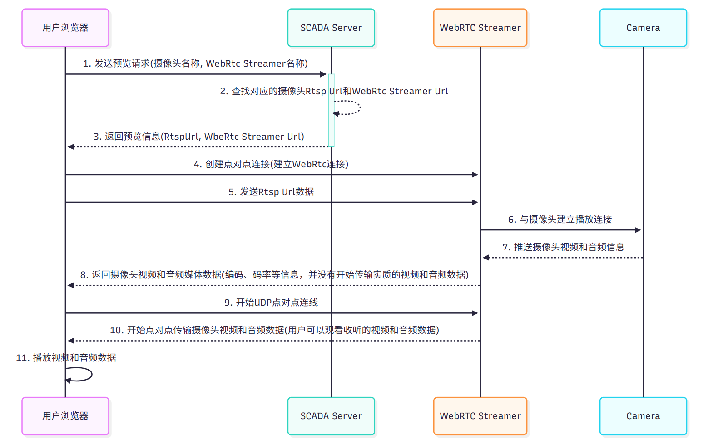

# 部署WebRTC Streamer服务

1. 如果 SCADA 部署在外部互联网环境，且需要在外部互联网环境访问Camera，那么请一定要进行[known-link]配置。

2. WebRtc Streamer所在服务器也要部署在外部互联网可以访问的服务器。

3. 在WebRtc Streamer启动时附加Turn服务器信息。

## UML 时序图



## 部署

#### Linux

###### 下载安装包

WebRTC Streamer下载地址： [https://github.com/mpromonet/webrtc-streamer/releases](https://github.com/mpromonet/webrtc-streamer/releases) 

下图是 v0.8.10 的下载界面，红框为Linux版本，请根据对应处理器版本选择下载，如不清楚处理器版本，可选择 Linux-armv7l-Release.tar.gz 版本下载


####### 部署服务

将下载的压缩包解压至目标目录

```bash
# 进入 WebRTC-Streamer 目录
cd /path/to/webrtc-streamer  

# 运行命令 -o 参数表示转换Rtsp到WebRtc时不会转码，这样对于服务器的性能消耗最低
./webrtc-streamer -H 0.0.0.0:8000 -o 

# 如果 webrtc-streamer 没有执行权限，先赋予权限
chmod +x webrtc-streamer

# 然后再运行 启动命令
./webrtc-streamer -H 0.0.0.0:8000 -o 
```
 


##### Windows

####### 下载安装包

WebRTC Streamer下载地址： [https://github.com/mpromonet/webrtc-streamer/releases](https://github.com/mpromonet/webrtc-streamer/releases) 

下图是 v0.8.10 的下载界面，红框中的为Windows版本，请点击下载


####### 部署服务

方式1：进入解压后的 `bin` 目录，双击 `webrtc-streamer.exe`，默认情况下，WebRTC-Streamer 在 **8000 端口**运行。

方式2：通过命令行启动。在 Windows 命令行（CMD 或 PowerShell）中，进入 `webrtc-streamer.exe` 所在的目录，然后执行：

```bash
# -H 0.0.0.0:8000，其中8000就是你指定的端口
webrtc-streamer.exe -H 0.0.0.0:8000 -o  
```
 
##### Docker 

以下步骤都基于Docker已经安装。如果未安装Docker，请参考官方文档： [Install | Docker Docs](https://docs.docker.com/engine/install/)   

####### 使用镜像

```docker
# -o 参数表示转换Rtsp到WebRtc时不会转码，这样对于服务器的性能消耗最低
docker run -p 8000:8000 -it mpromonet/webrtc-streamer -o
```
 
#### 将Webrtc-streamer安装为Windows服务

1. 打开NSSM官网并下载NSSM  [NSSM - the Non-Sucking Service Manager](https://nssm.cc/download)


2. 下载完毕后，将下载的nssm-2.24放置在您的软件安装目录(一个统一管理的目录，可以按照你的想法创建)并解压


3. 根据您电脑的处理器版本进入对应的文件夹，例如64位电脑进入win64，32位电脑进入win32，这里以64位电脑举例


4. 已管理员身份运行CMD，并进入您的nssm.exe目录


例如我的nssm.exe文件在D盘，具体目录在D:\Document\Podman\nssm-2.24\nssm-2.24\win64，我们可以在cmd中执行以下命令

```bash
d:
cd D:\Document\Podman\nssm-2.24\nssm-2.24\win64
```
 


然后在命令行中输入 nssm install WebRTCStreamerService 后回车


这时会弹出window服务安装窗口  

请在Path输入款点击右侧按钮，选择您的webrtc-streamer.exe

在Argument输入框输入启动参数 -H 0.0.0.0:8000 -o      **在-H之前有个空格，不要忘记输入**


点击install service


可以看到服务已经安装完毕

5. 打开服务列表，找到刚安装完毕的服务


6. 选中服务，点击右键，选择 "属性" 点击，然后切换到恢复页面，然后修改 第一次失败和第二次失败


点击应用，然后点击确认


7. 然后在服务列表选中服务，点击右键启动


8. 访问 http://localhost:8000


9. 就此服务安装完毕

#### 无法播放问题处理

##### 防火墙

在服务部署后，可能还是无法播放Camera的RTSP连接，这时候需要建立对应的端口规则，将WebRtc Streamer的启动端口放开，例如8000(启动TCP端口)、3478(内置的STUN服务器TCP和UDP端口)、49152-65535(建立WebRtc连接的UDP端口)

需要创建**8000**(也就是你指定的WebRtc Streamer的启动端口)、**3478**(内置的STUN服务器端口)的**TCP**和**UDP**的**入站规则**和**出站规则**

需要创建**UDP**端口**49152–65535**的**入站规则**和**出站规则**

然后在WebRtc Streamer启动时附加对应的参数和命令，例如：**webrtc-streamer.exe -H 0.0.0.0:8000 -S -R 49152:65535 -o**

###### **打开防火墙**


####### **入站规则**

1. 在入站规则=>新建规则


2. 选择端口并按照下图选项创建规则


3. 完成TCP 3478，8000启动端口入站规则创建
4. 然后重复步骤1~3，完成UDP 3478, 8000, 49152–65535的入站规则创建


####### **出站规则**

1. 在出站规则=>新建规则


2. 选择端口并按照下图选项创建规则


3. 完成启动端口3478, 8000 TCP出站规则创建
4. 然后重复步骤1~3，完成UDP 3478, 8000, 49152–65535的出站规则创建


####### **启动WebRtc Streamer**

```bash
webrtc-streamer.exe -H 0.0.0.0:8000 -S -R 49152:65535 -o
# 参数说明
# -H 0.0.0.0:8000 说明WebRtc Streamer通过8000端口访问
# -S 启动内部的STUN服务器(端口是3478) 如果没有-S参数，那么默认的STUN服务器将使用Google的STUN服务器 stun.l.google.com:19302
# -R 49152:65535 WebRtc创建UDP连接时，UDP端口的使用范围
# -o 不使用编码器 采用原始RTSP流的编码。此参数将降低CPU使用率和服务器压力
```
 
