# 许可证和激活

WAGO SCADA 许可证用于WAGO SCADA安装服务器激活, 同一个安装实例只需要激活一次，可在多个浏览器客户端中打开。

支持 **在线** 和 **离线** 两种激活方式。

#### 试用模式

WAGO SCADA安装之后可以对所有功能进行试用，试用有2小时倒计时。时间到了之后，未授权模块将停止工作，需要进行重置，重置后可继续试用2小时。试用没有绝对的时间限制，每次重置后都可继续试用。如果购买了所有模块，将不再显示倒计时。如果只购买了部分模块，还会显示倒计时。如果只购买了基础平台模块，驱动数采将不会停止，画面不再强制登出，其他试用模块仍然需要每隔2小时进行重置。

| **试用模块**   | **试用行为** |
|:----------------|:----------------------|
| 基础平台模块   | 每隔2小时停止停止所有数据推送，停止读写变量，所有用户强制登出，登录后可点击”重置试用”按钮继续试用                                          |
| 2D可视化模块   | 每隔2小时停止前端数据推送，预览和运行页面强制跳转到“试用已过期”提示界面                                                                  |
| 3D可视化模块   | 如果画面中使用了“3D查看器“控件，每隔2小时停止该画面整个画面的数据推送，预览和运行页面强制跳转到“试用已过期”提示界面                       |
| 数据库连接模块 | 数据库连接除了内置的sqlite不受影响，其他类型的数据库连接每隔2小时断开连接，依赖于数据库连接的模块不再工作，比如历史存储，将不再进行数据存储 |

#### 试用倒计时

WAGO SCADA后台服务一旦启动，试用倒计时立即开始。所有试用模块统一倒计时。每次可试用2小时，2小时后可重置试用。

在未购买任何模块的情况下，显示试用倒计时；如果已购买了至少一个模块，则页面上不会再显示试用到期时。

#### 试用过期

如果用户使用了未购买的模块，在试用模块到期后，画面预览和运行时页面强制跳转到“试用已过期”提示界面。会显示试用模块以及重置试用方法。

#### 重置试用

如果用户未购买任何模块，试用到期后，在管理平台和设计器页面上会弹出试用到期提示，点击弹窗中的“**重置试用**”按钮或者账号下的“**重置试用**”按钮，可以再次试用。

试用到期后，账号右上角会显示红点。

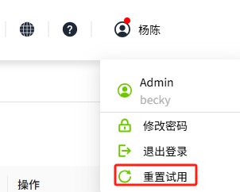

点击“**重置试用**”后会弹出重置试用窗口，点击“确认”按钮，完成重置。

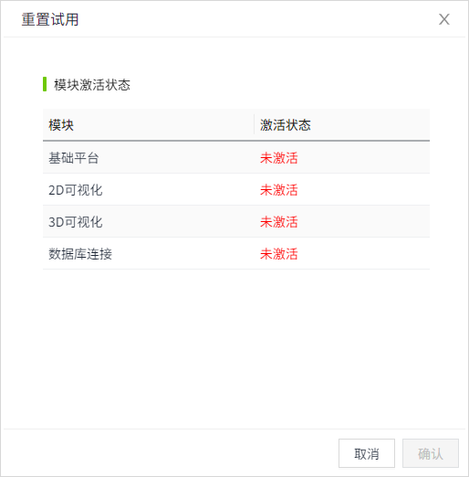

如果用户已购买了部分模块，试用到期后，不会在管理平台和设计器页面上弹出试用到期提示，可以在账号下点击“**重置试用**”按钮，再次试用。

试用到期后，账号右上角会显示红点。

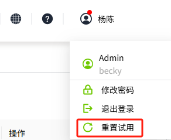

点击“**重置试用**”后会弹出重置试用窗口，点击“确认”按钮，完成重置。

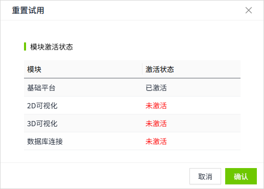

#### 激活

###### 在线激活示例

如果您的安装服务器接入外网，能够访问WAGO SCADA许可服务站点, 可以选择在线激活。激活后密钥将和安装服务器进行绑定，同一密钥不可在多台服务器进行激活。

激活步骤：

1. 在“节点”->“许可证”页面，点击“激活License”按钮。

    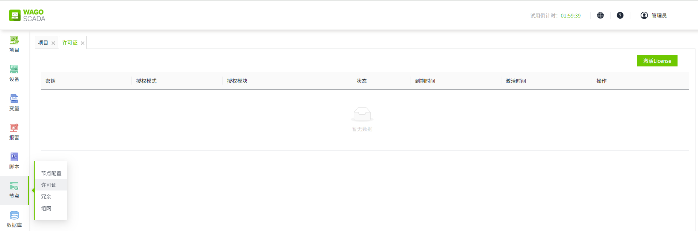

2. 填写密钥，阅读协议，点击“在线激活”按钮。

    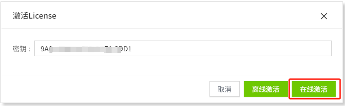

3. 激活成功后许可证列表将显示授权信息，对于已激活的密钥可以进行反激活和刷新操作。

    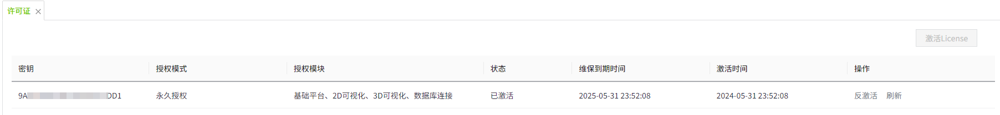

###### 离线激活示例

如果您的安装服务器没有接入外网，可以按以下步骤进行离线激活。

激活步骤：

1. 点击“离线激活”按钮。

    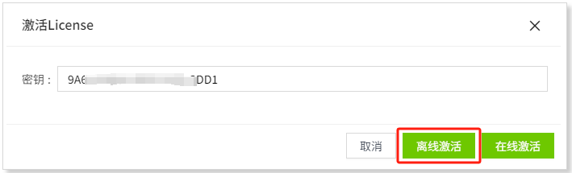

2. 点击“生成激活请求”按钮，将自动生成并显示激活请求内容。请保存好激活请求内容。

    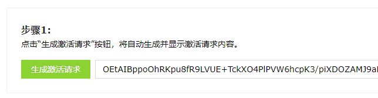

3. 将生成的激活请求内容传输到具有网络访问权限的机器上。访问以下地址并输入请求内容，确认后会自动生成许可证。

    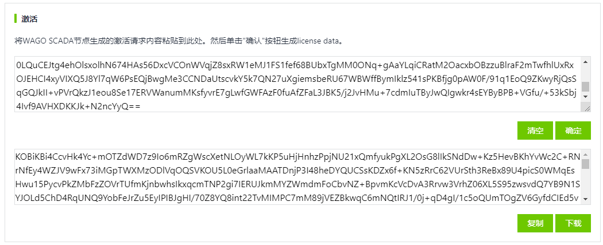

4. 返回离线激活页面，粘贴输入许可证，点击“激活按钮”，至此完成离线激活操作。

    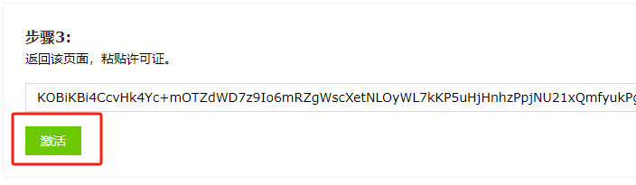

#### 反激活

当需要更换服务器时，需要把先进行反激活操作，同一个密钥只有三次反激活机会，次数用完之后将不支持反激活，非必要请不要随意使用反激活功能。

###### 在线反激活示例

如果您的安装服务器接入外网，能够访问WAGO SCADA许可服务站点, 可以选择在线反激活。

###### 离线反激活示例

如果您的安装服务器没有接入外网，可以按以下步骤进行离线反激活。

请注意，离线反激活时本机不会检测剩余反激活次数，只有在向服务器提交离线反激活请求内容时才会做校验。所以可能出现生成离线请求成功，但是因为离线请求次数用尽，提交离线请求内容时失败的情况。发生此种情况不用担心，可以在原服务器使用相同的密钥进行激活，恢复正常使用。

1. 点击“离线反激活”按钮

    

2. 点击“生成反激活请求”按钮，将自动生成并显示反激活请求内容。 点击后许可证将从当前机器上删除。请保存好反激活请求内容。

    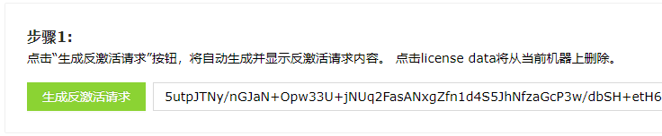

3.  将生成的反激活请求内容传输到具有网络访问权限的机器上。访问WAGO SCADA许可服务站点，输入反激活请求内容到反激活输入框，点击确认按钮后，会自动进行反激活。

    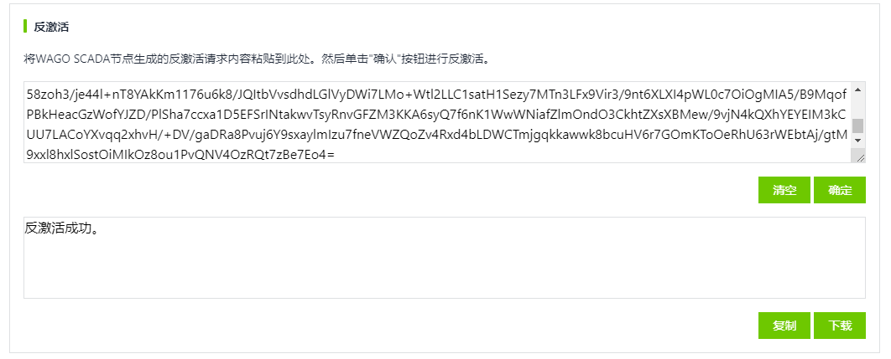

#### 刷新

如果您进行了维保续费操作，或者购买了新模块，可以对许可证进行刷新操作, 以获取并更新最新授权信息。

###### 在线刷新示例

如果您的安装服务器接入外网，能够访问WAGO SCADA许可服务站点, 可以选择在线刷新。 

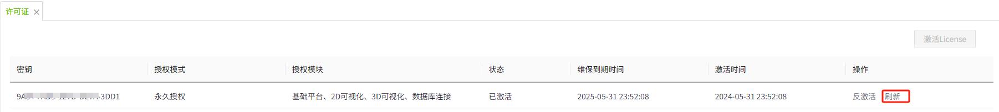

###### 离线刷新示例

如果您的安装服务器没有接入外网，可以按以下步骤进行离线刷新。

1. 点击“离线刷新”按钮。

    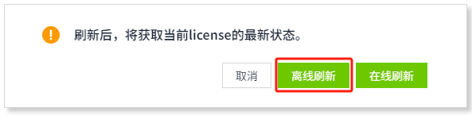

2. 点击“生成刷新请求”按钮，将自动生成并显示刷新请求内容。请保存好刷新请求内容。

    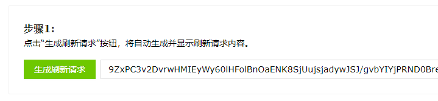

3. 将生成的刷新请求内容传输到具有网络访问权限的机器上。访问WAGO SCADA许可服务站点并输入请求内容，确认后会自动生成新许可证。将许可证拷贝并传输到待刷新服务器上。

    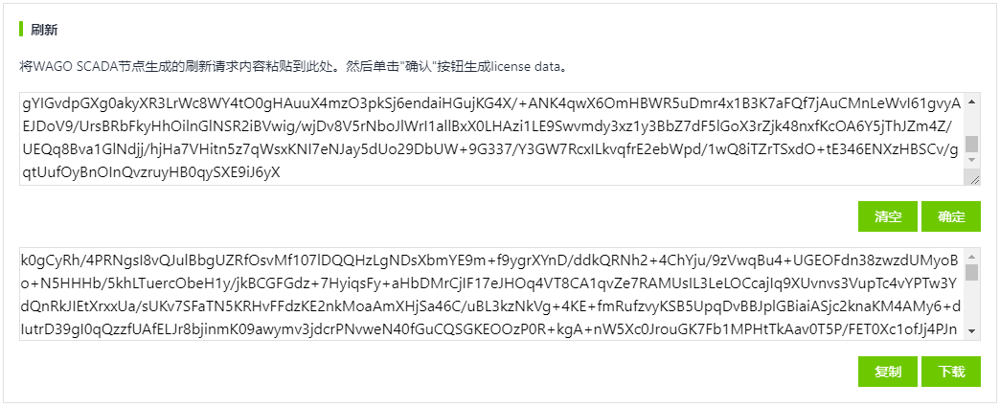

4. 返回离线刷新页面，粘贴输入新许可证，点击“刷新”按钮，至此完成离线刷新操作。

    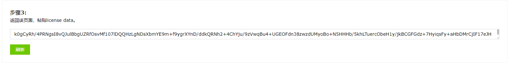

#### 紧急激活

如果安装WAGO SCADA的服务器硬件损坏或者系统环境异常导致无法正常使用，也无法进行授权码反激活，可以在一台新机器上使用相同的激活码进行紧急激活，紧急激活操作方法和上述在线或者离线激活方法一致。紧急激活的License只有7天有效期，7天后进入试用模式。在这7天内可尝试修复损坏的服务器，如确实无法修复可联系售后人员反应情况进一步处理。

建议平时做好工程配置数据备份，这样在需要紧急激活使用时无需重新配置，导入备份的工程数据即可。

每一个授权码有且仅有一次使用紧急激活的机会。如果没有特殊情况，请不要尝试在多台机器上激活同一授权码，防止浪费一次紧急激活的机会。

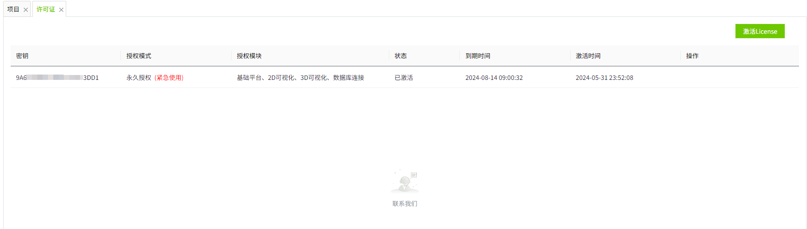

#### 续费

如果您需要对一个授权码进行续费操作，在完成续费订单之后，相关售后人员会对原有授权码进行续费操作，您只需对许可证进行刷新操作即可。

#### 增加模块

如果您需要购买新模块，在完成增加模块订单之后，相关售后人员会对原有授权码进行增加模块操作，您只需对许可证进行刷新操作即可。

