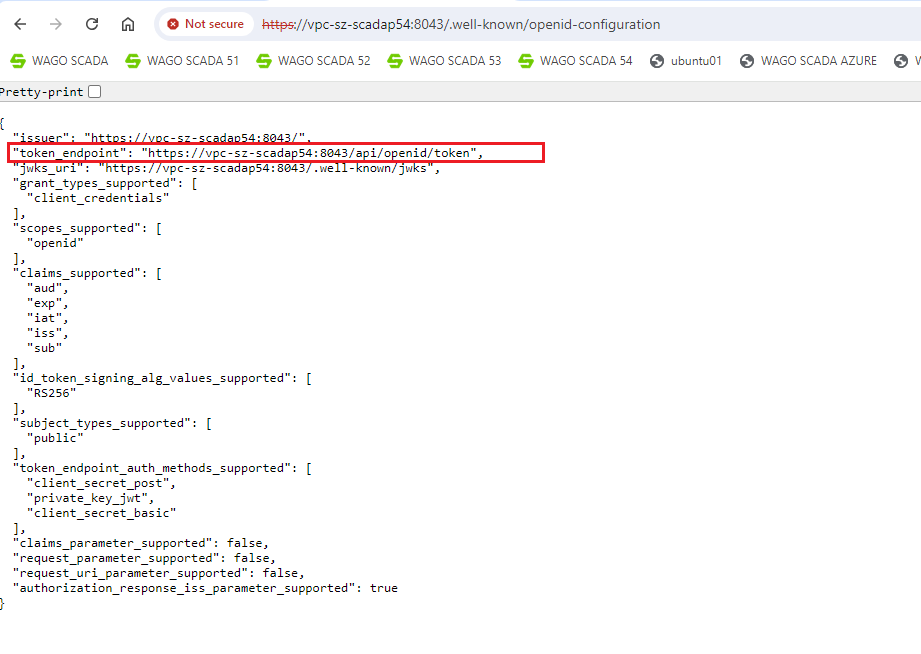
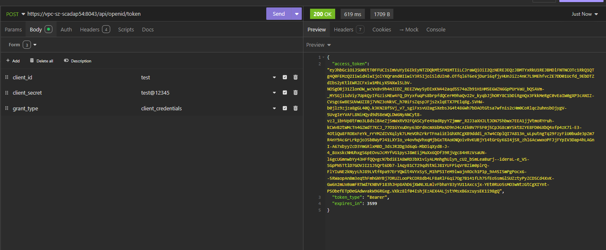

# Open Id Connect

开放 API 集成了标准的 Open Id Connect 协议。要调用开放 API，第三方应用程序应使用客户端 ID 和客户端密钥（如何获取客户端ID和客户端密钥请参考 [OpenID Connect客户端](../security/open-api.md)）向WAGO SCADA进行访问令牌验证和授权，但在获取客户端ID和密钥之前，首先需要获取WAGO SCADA Open API的令牌验证授权地址，请在浏览器输入地址  [https://{host}/.well-known/openid-configuration](https://server.com:8443/.well-known/openid-configuration) 以获取WAGO SCADA Open Id Connect 的配置信息，其中包含一个用于Open API令牌验证和授权的地址 `token_endpoint`。

**注意**：Open API只支持https协议，所以请使用https获取token_endpoint。



第三方应用程序将客户端 ID 和客户端密钥发送到 `token_endpoint` URL（具体的方式为：使用POST请求，在请求体Body中放入client_id、client_secret以及grant_type三个参数，其中grant_type参数的值必须是client_credentials，例如：

```Plain Text
grant_type=client_credentials&client_id=your_client_id&client_secret=your_client_secret
```
 
），服务器随后返回访问令牌，随后第三应用程序就可以使用这个access_token访问被授权的WAGO SCADA Open API了。



