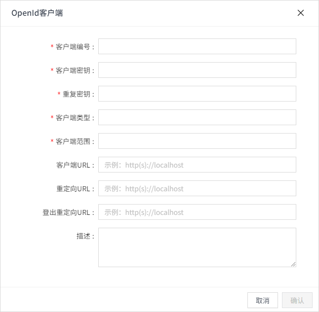
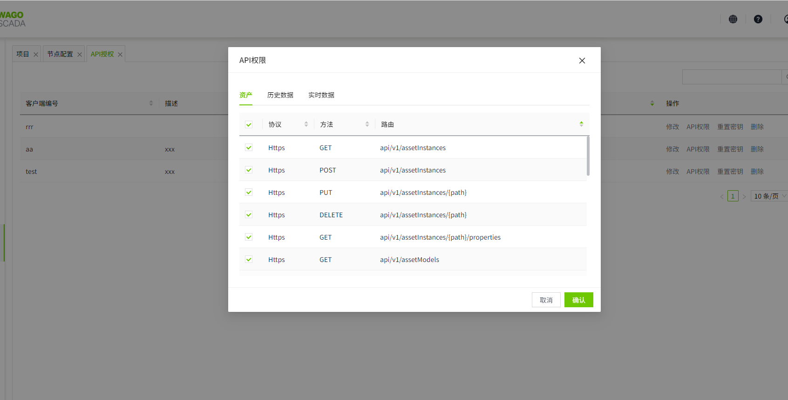
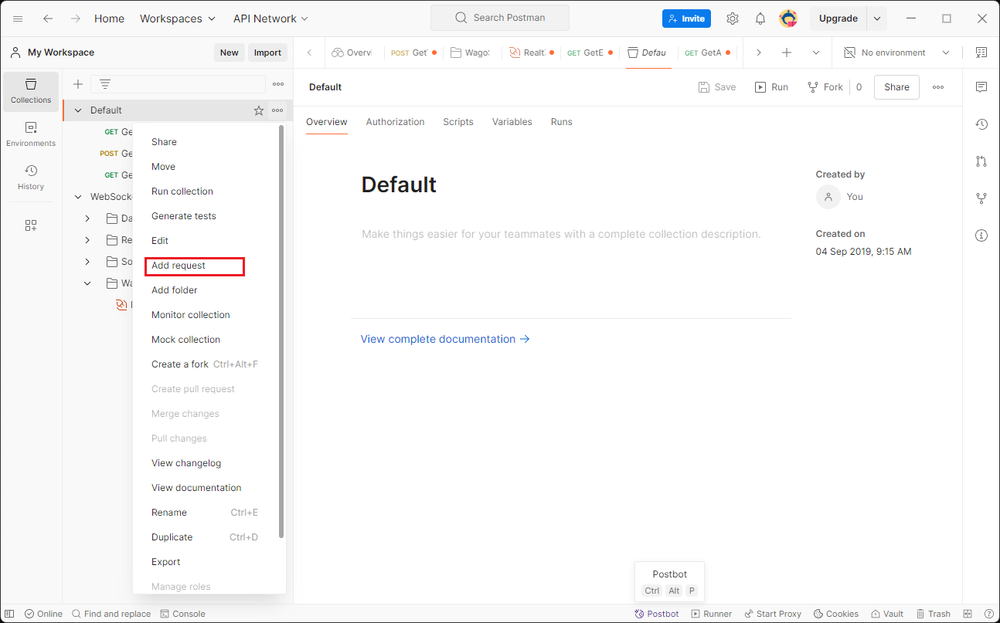
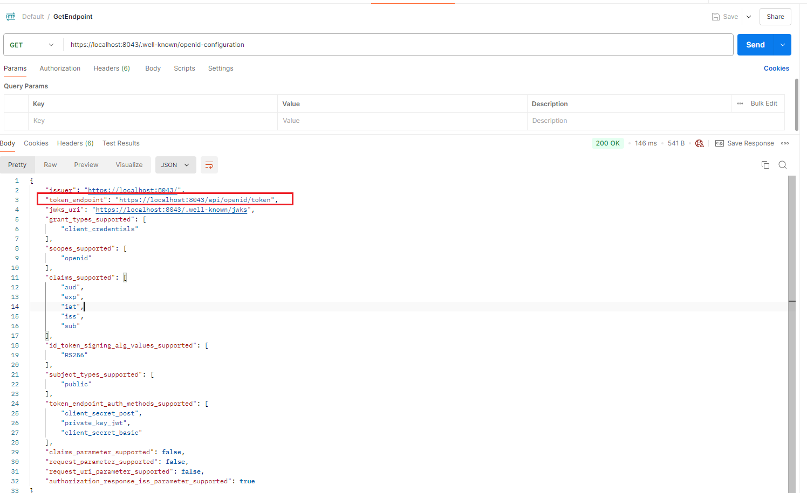
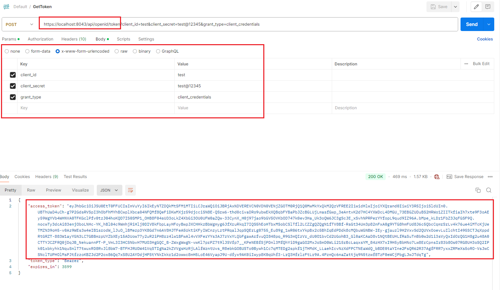
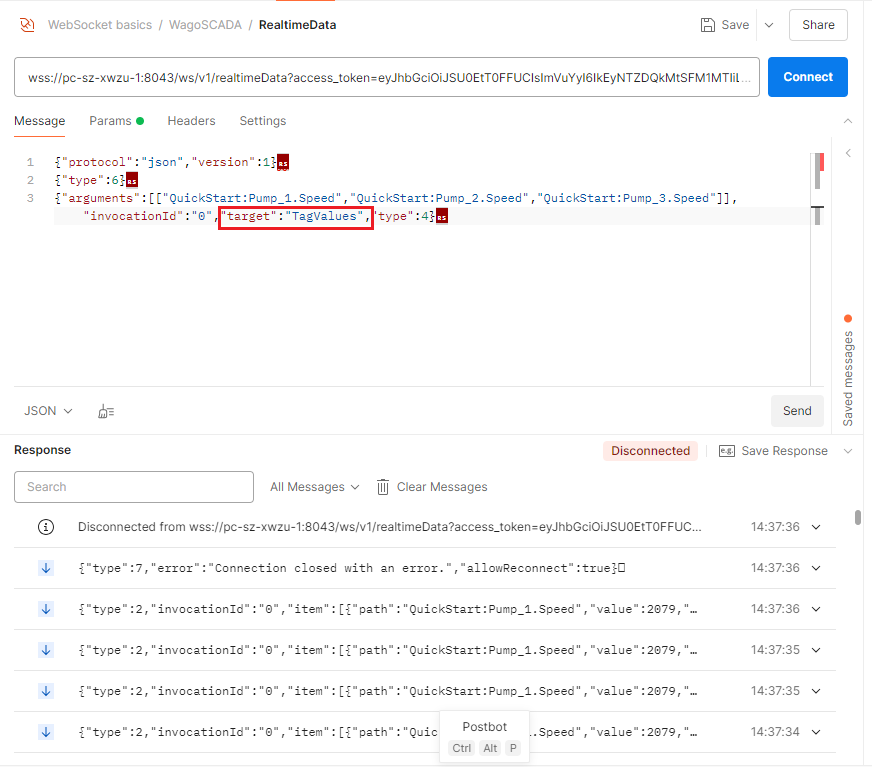

# 获取access_token

在测试 Open API 之前，我们应该先获取访问令牌（access token）

1. 登录 SCADA，进入 API 凭据管理页面，并创建一对新的客户端 ID 和客户端密钥（client ID 和 client secret）。关于API授权管理可以参考 [OpenID Connect客户端](../../security/open-api.md)

    

2. 点击 **API权限** 按钮并给新创建的客户端ID附上所有的权限。

    

3. 打开 Postman 应用程序，点击菜单创建一个 HTTP 请求，如下图所示。

    

4. 创建一个针对 URL `https://localhost:8043/.well-known/openid-configuration` 的 GET 请求。点击“Send”按钮发送请求，并从响应中提取 Token URL。请注意，Open API 仅支持 HTTPS 协议。HTTPS 的默认端口是 8043，可以在节点设置页面进行配置。关于节点配置，可以参考 [节点配置](../../node-configuration/index.md)

    

5. 输入在 API 凭据页面注册的客户端 ID 和客户端密钥，如下例所示。将 `grant_type` 设置为 `"client_credentials"`，然后点击“Send”按钮。访问令牌（access token）可以从 HTTP 响应中提取。请注意，请求体格式必须为 `x-www-form-urlencoded`。

    

6. 以上的示例展示了订阅实时变量步骤，对于其他的类型的实时数据可以参考下面示例中的payload中的target字段代表实时数据API的方法名称。您可以通过将target值替换为在实时数据API定义文档中指定的方法名称，来调用其他WebSocket API。

    
