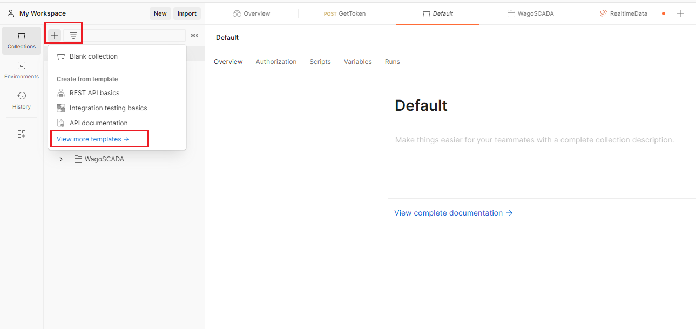
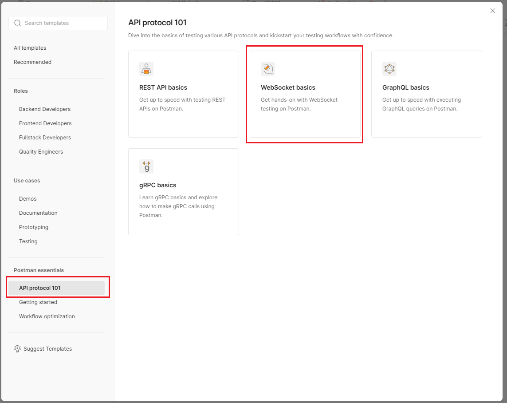
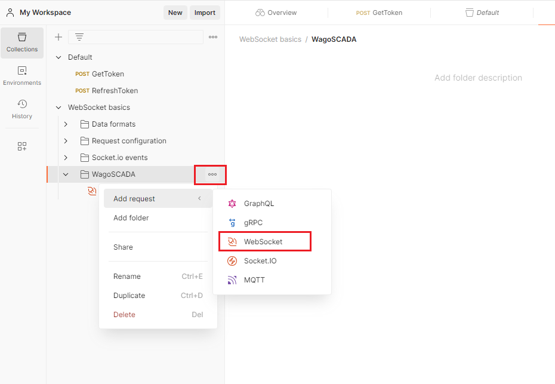
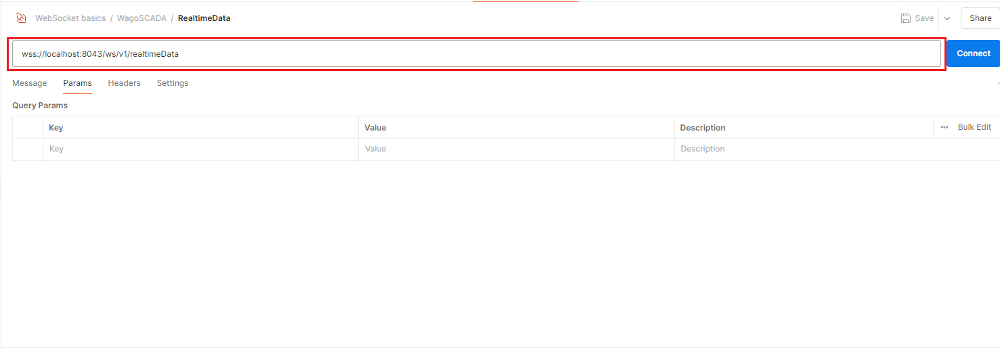
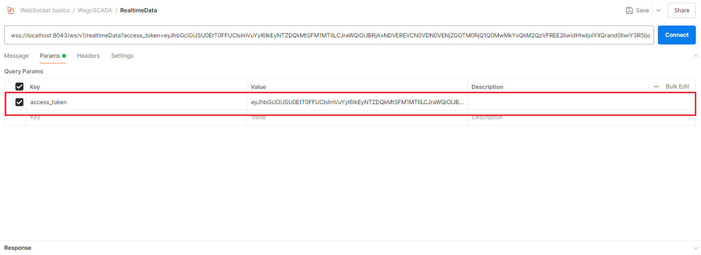
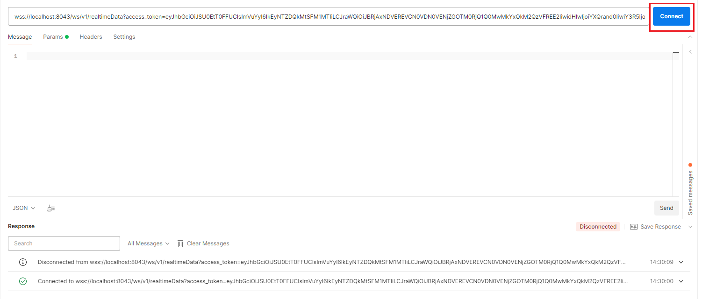
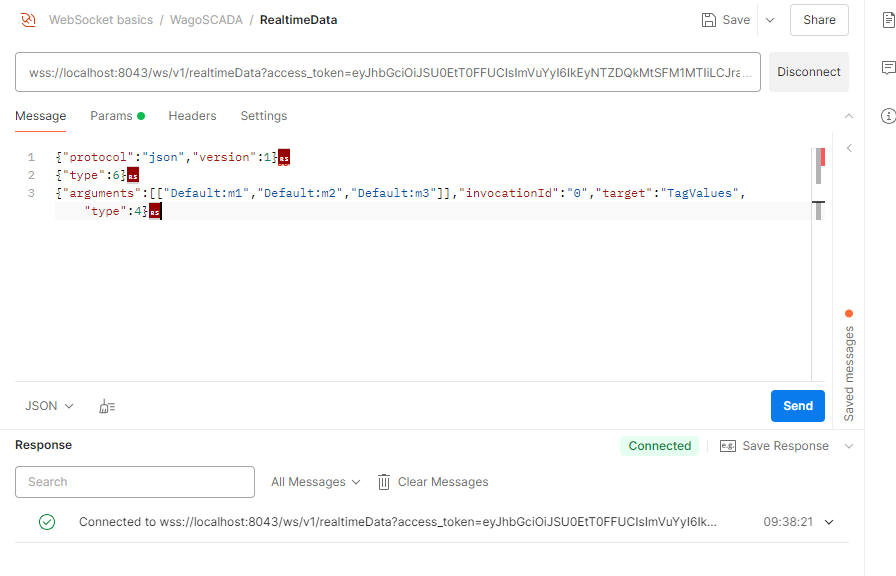
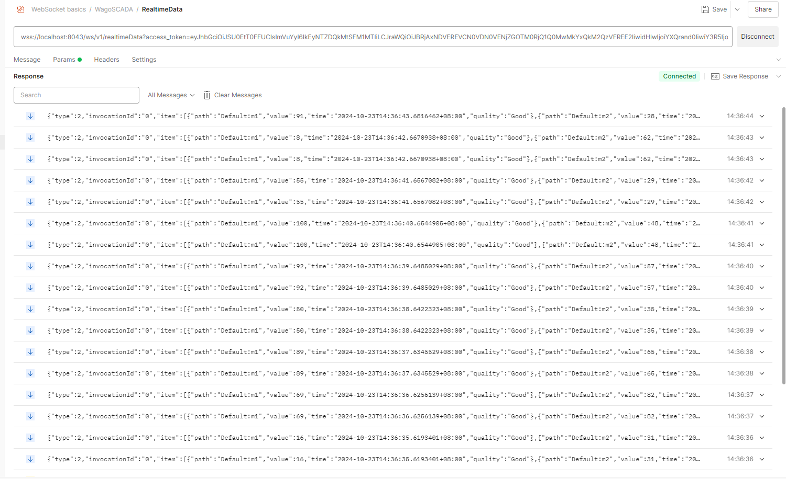

# 订阅实时数据

Open API提供了用于实时数据访问的WebSocket API。通过使用WebSocket API，您可以订阅实时数据，包括变量值、变量属性和报警。

1. 打开postman主页，点击按钮+, 然后点击View more templates

    

2. 点击左侧API protoco 101,然后在右侧选择WebSocket basics

    

3. 在“WebSocket基础”下创建一个新文件夹。点击新文件夹的下拉菜单以打开菜单，如下图所示，然后点击“WebSocket”选项。

    

4. 在地址栏中输入地址wss://localhost:8043/ws/v1/realtimeData

    

5. 在Params中输入access_token, 注意websocket的access_token前面不需要添加Brear

    

6. 点击“Connect”按钮，Postman将显示WebSocket连接已建立。

    

7. 成功连接后，在Message Tab下发送以下的报文, 注意报文结尾处的特殊字符不能遗漏，第三行报文中的`[["Default:m1","Default:m2","Default:m3"]]`需要替换成工程中实际上存在的变量

    {"protocol":"json","version":1}

    {"type":6}

    {"arguments":`[["Default:m1","Default:m2","Default:m3"]]`,"invocationId":"0","target":"TagValues","type":4}

    

8. 成功发送上述的三个报文之后会接收到变量的推送

    

