# 集成Azure AD并启用MFA

WAGO SCADA的Identity Provider与Azure AD兼容，可实现无缝集成。通过利用Azure AD的多因素认证（MFA）功能，Azure AD可间接为SCADA系统扩展MFA支持，从而增强安全性。

1. 打开Azure 管理平台( [https://portal.azure.com]( https://portal.azure.com/)) ,  点击进入 Microsoft Entra ID配置界面。

    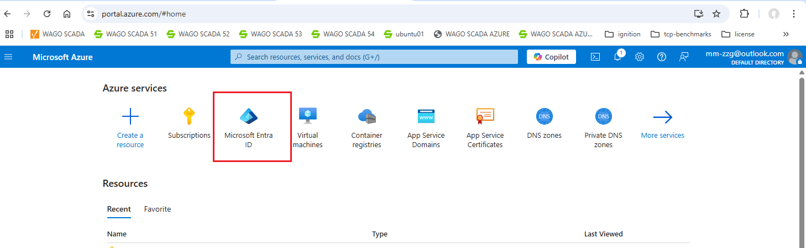

2. 点击左侧菜单面板中的 “App registration”，并点击按钮 “+ New registration”，然后就会进入应用注册界面。

    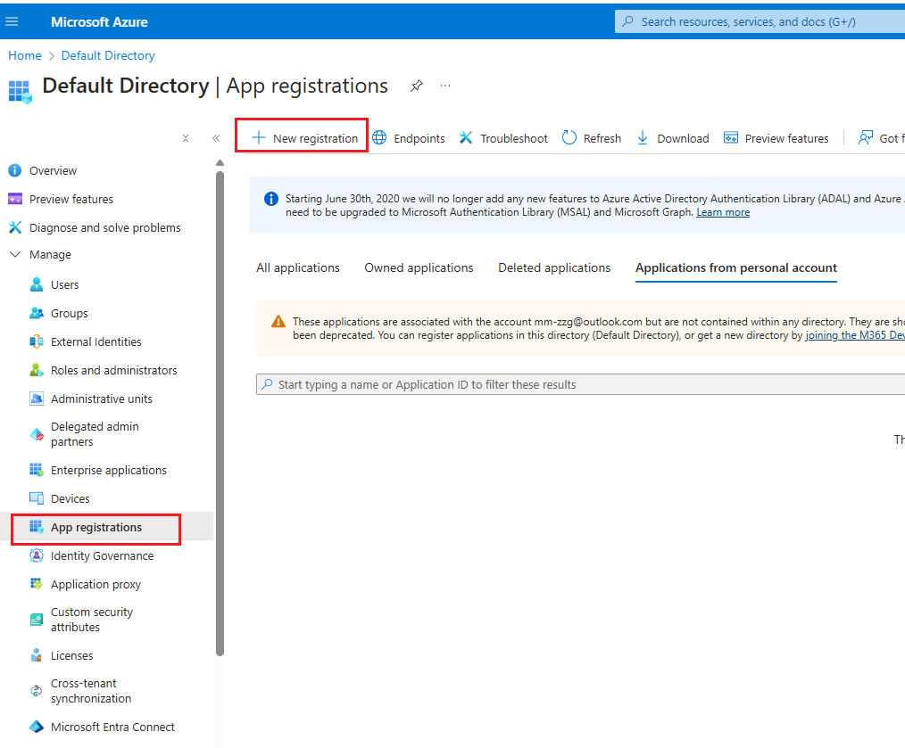

3. 点击左侧菜单面板中的 “Authentication”,  然后将SCADA的登录回调地址和登出回调地址填入"Web Redirect URIs"配置项中。

    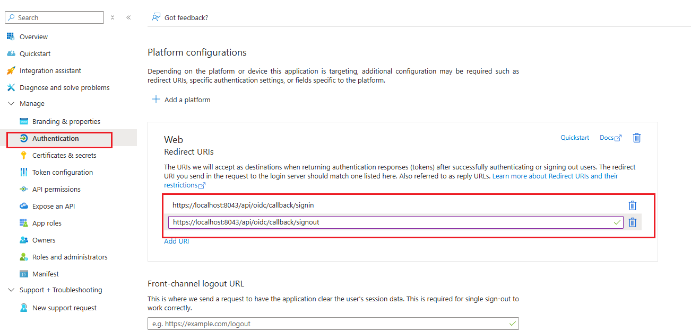

4. 点击左侧菜单中的 “Token configuration”,  根据需要添加optional claim。

    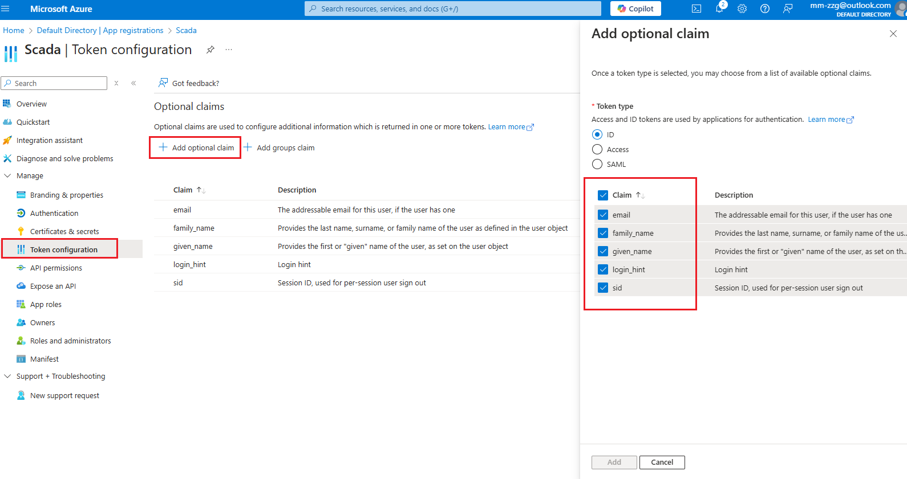

5. 点击左侧菜单栏中的 “Certificates & secrets”,创建一对Client Id和Client Secret。

    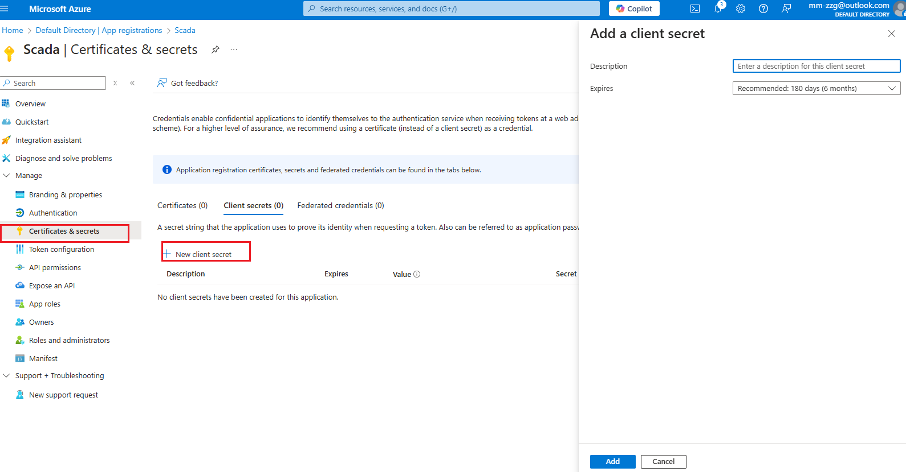

6.  将创建好的密钥复制出来。

    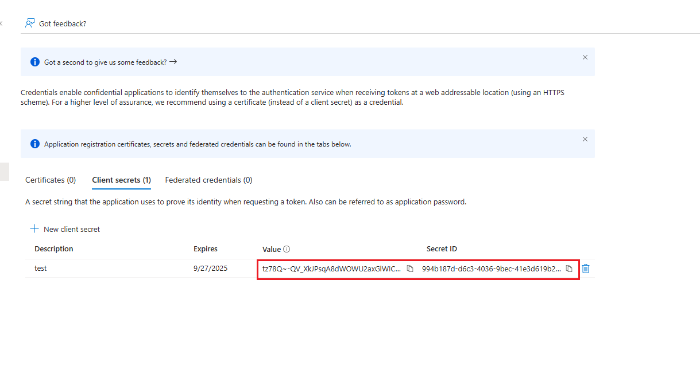

7. 点击左侧菜单栏中的“Overview”菜单，然后点击“Endpoints”图标并复制“OpenID Connect metadata document”中的地址。

    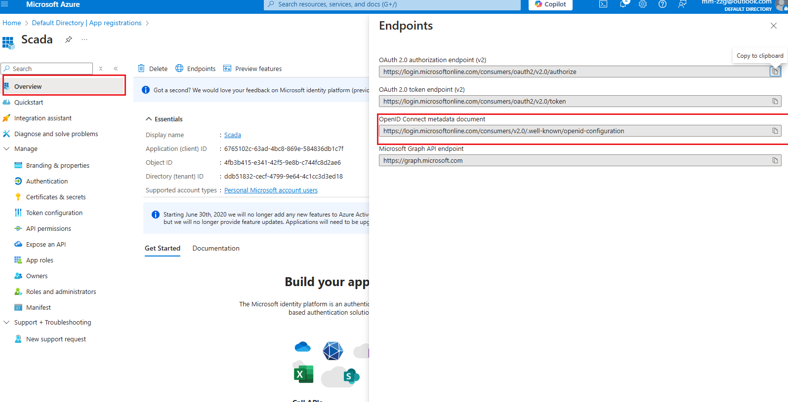

8. 回到“Microsoft Entra ID”的根目录,  然后点击左侧菜单栏中的 “Users” 菜单。

    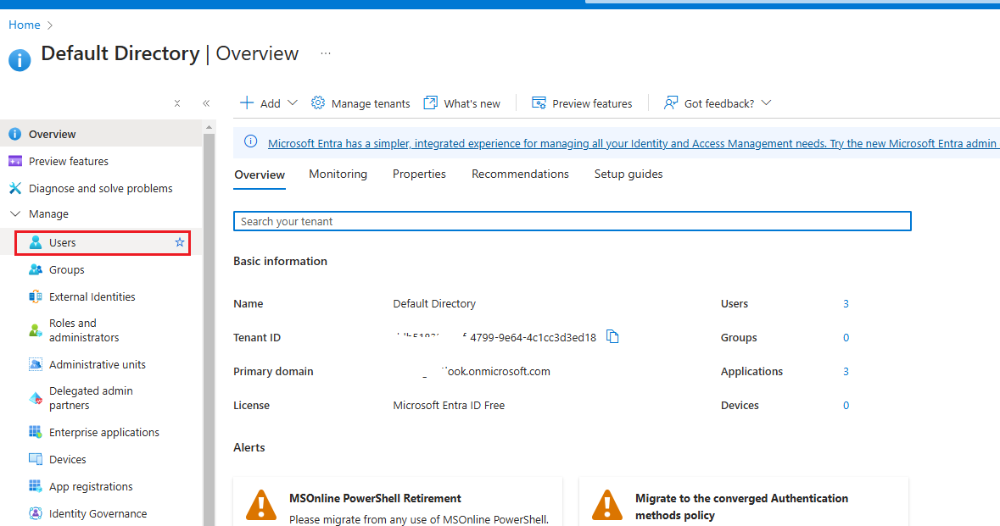

9. 点击 “Per-user MFA” 图标,。

    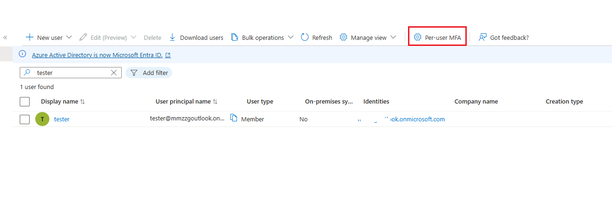

10. 选择用户并点击 “Enable MFA” 按钮,  此时选中用户的MFA功能被启用。 

    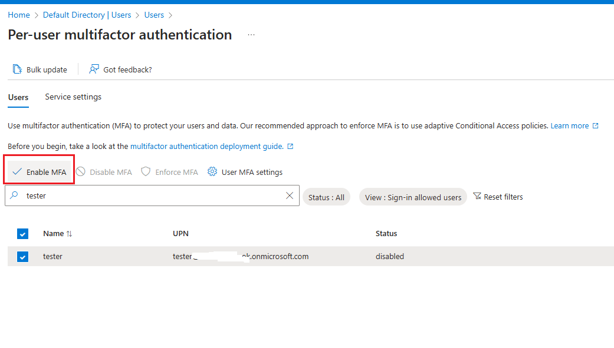

11. 回到SCADA 的identity provider 页面, 使用之前复制的Client Id, Client Secret以及OpenID Connect metadata document传进一个Identity Provider。

    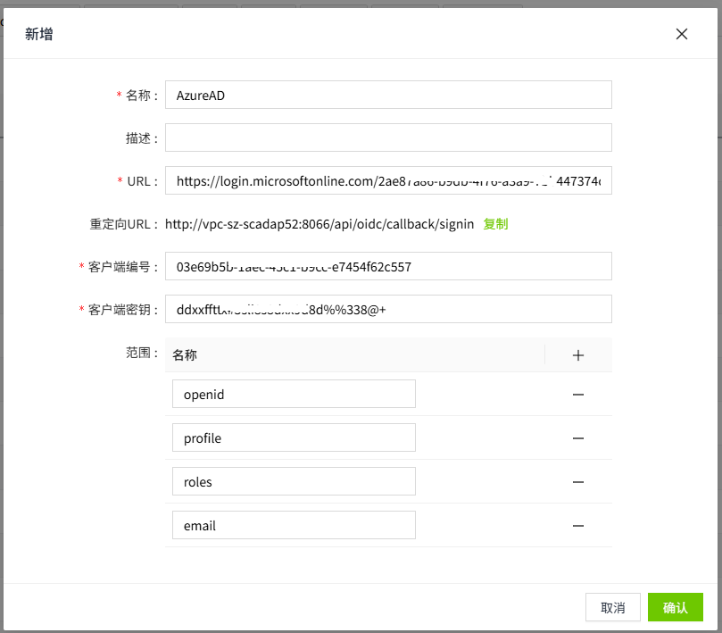

12. 在新创建的 AzureAD provider测试连接，然后当前页面会导航到微软的登录页面。

    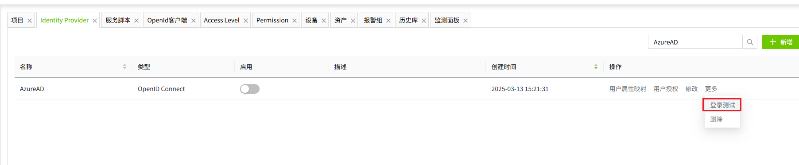

    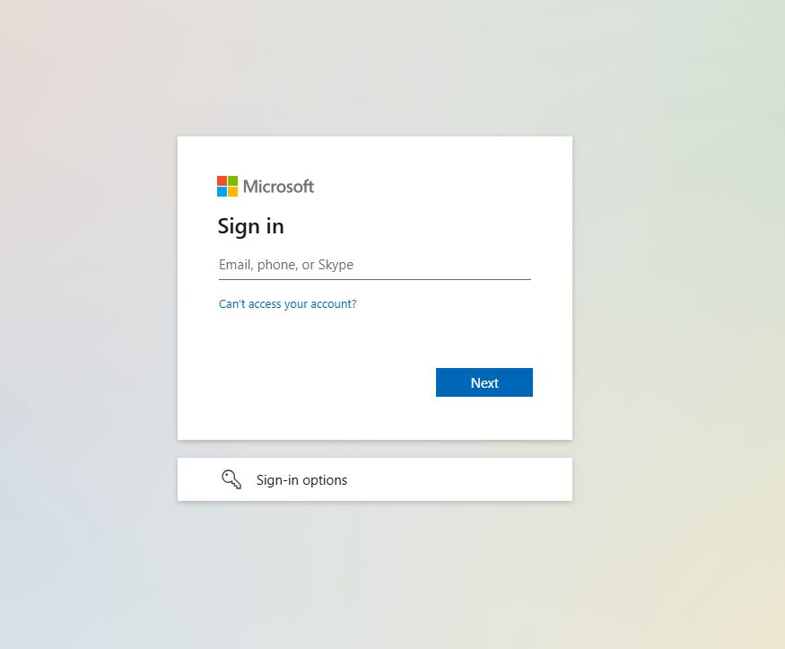

13. 输入个人的微软账号或者域账号, 然后登录界面会显示一个随机数用于验证用户的登录。

    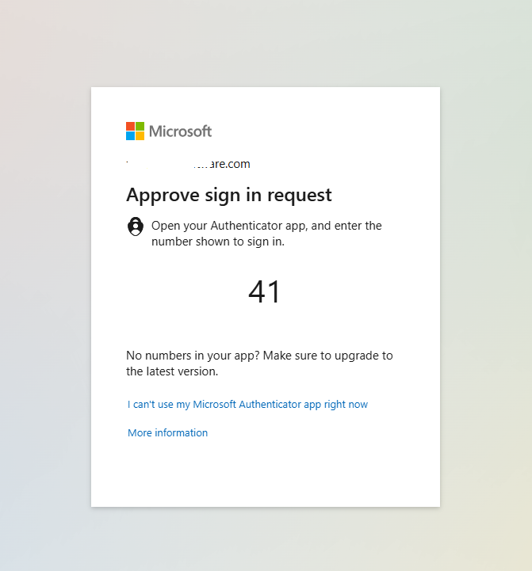

14. 在移动设备上的“Microsoft Authenticator”应用上输入这个随机数，然后登录请求被成功认证。

    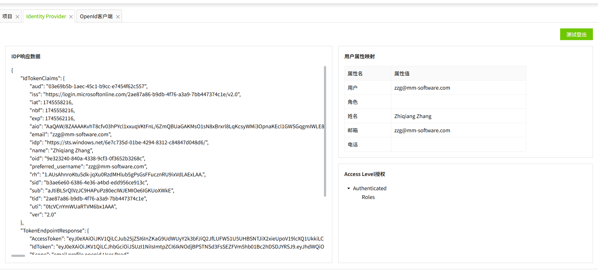

  

