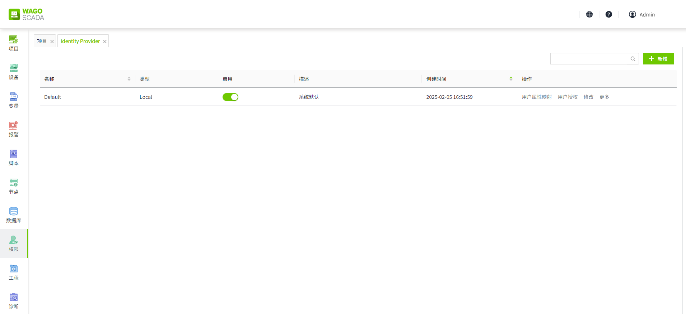
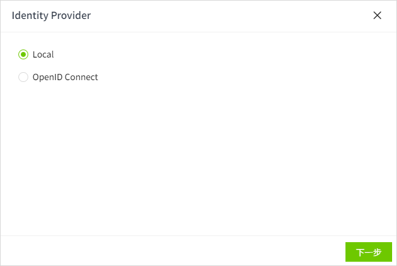
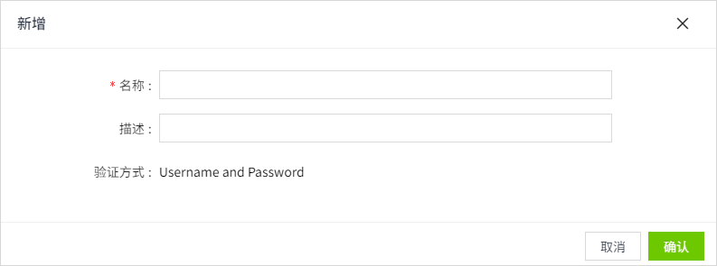
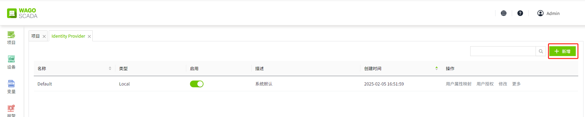
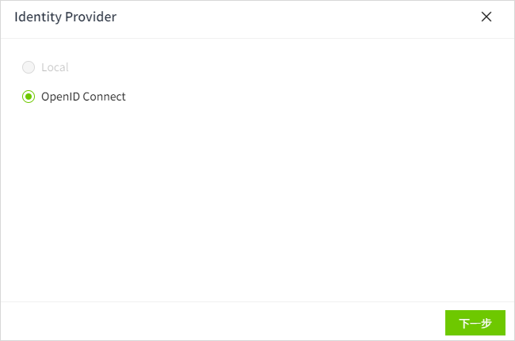
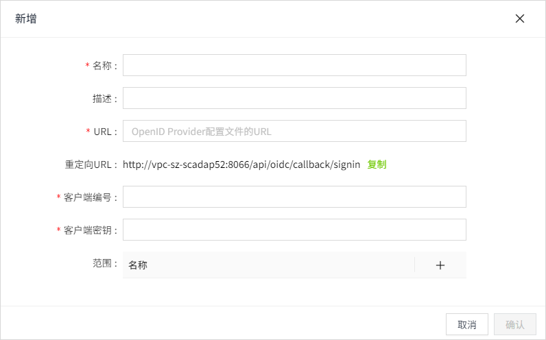
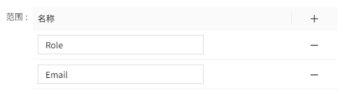
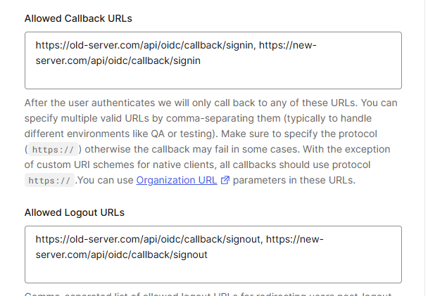

# Identity Provider

Identity Provider为用户提供了一种使用存储在WAGO SCADA外部的凭证登录WAGO SCADA的方法。支持单点登录(SSO)。

WAGO SCADA可以连接到以下2种不同类型的Identity Provider：

- Local（WAGO  SCADA的内部Identity Provider）
- OpenID Connect

WAGO SCADA安装成功后，在Identity Provider列表中会显示内置的一条Identity Provider。

**说明**：只允许存在 **1个** 类型为 **Local** 的Identity Provider。

## 新增Local类型的Identity Provider

当启用Local类型的Identity Provider时，使用在系统内创建的用户进行登录。

**前提：** 当前不存在Local类型的Identity Provider。

1. 在 **“权限”->“Identity Provider”** 列表的右上角，点击”新增“按钮。

    

2. 在Identity Provider弹窗中，选择Local，点击“下一步”。

    

3. 在新增弹窗中填写名称后，点击“确认”按钮，完成新增操作。

    

## 新增OpenID Connect类型的Identity Provider

允许创建多个OpenID Connect类型的Identity Provider。

1. 在 **“权限”->“Identity Provider”** 列表的右上角，点击“新增”按钮。

    

2. 在Identity Provider弹窗中，选择OpenID Connect，点击“下一步”。

    

3. 在新增弹窗中设置完成后，点击“确认”按钮，完成新增操作。

    

**属性**

| **名称**   | **描述**  |
|:------------|:----------|
| 名称       | Identity Provider的名称。|
| 描述       | Identity Provider的描述。  |
| URL        | OpenID Provider配置文件的URL。 |
| 重定向URL  | OpenID Connect 认证成功或失败后，Identity Provider将用户的浏览器重定向到WAGO SCADA的 URL。 |
| 客户端编号 | Identity Provider分配给每个OpenID Connect客户端应用的唯一标识符。 |
| 客户端密钥 | 用于验证 OpenID Connect客户端身份的私密凭据，相当于“密码”。  |
| 范围       | 通过范围，WAGO SCADA告诉Identity Provider它需要访问哪些用户信息。   例如：     这表示WAGO SCADA请求访问用户的 **角色** 和 **电子邮件地址**。 |

## 注意事项

根据OpenID Connect (OIDC) 协议，若在WAGO SCADA中集成第三方Identity Provider（如Auth0），需在第三方平台配置WAGO SCADA的 **登录回调地址（Redirect URI）** 和 **登出回调地址（Post Logout Redirect URI）**。

当工程文件从原服务器导出并导入至新服务器时，由于新服务器的地址未在第三方Identity Provider中注册，OIDC校验将失败，导致用户无法登录。因此，**迁移工程后，必须在第三方平台（如Auth0管理界面）将新服务器的回调地址追加至原有配置中**。

**以Auth0为例的操作方法：**
在Auth0应用的`Allowed Callback URLs`和`Allowed Logout URLs`字段中，将新服务器地址以逗号分隔的形式添加到原有地址后方，例如：

