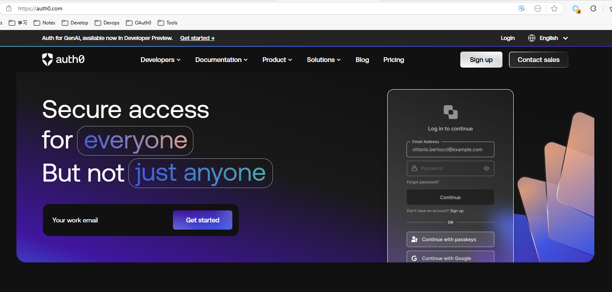
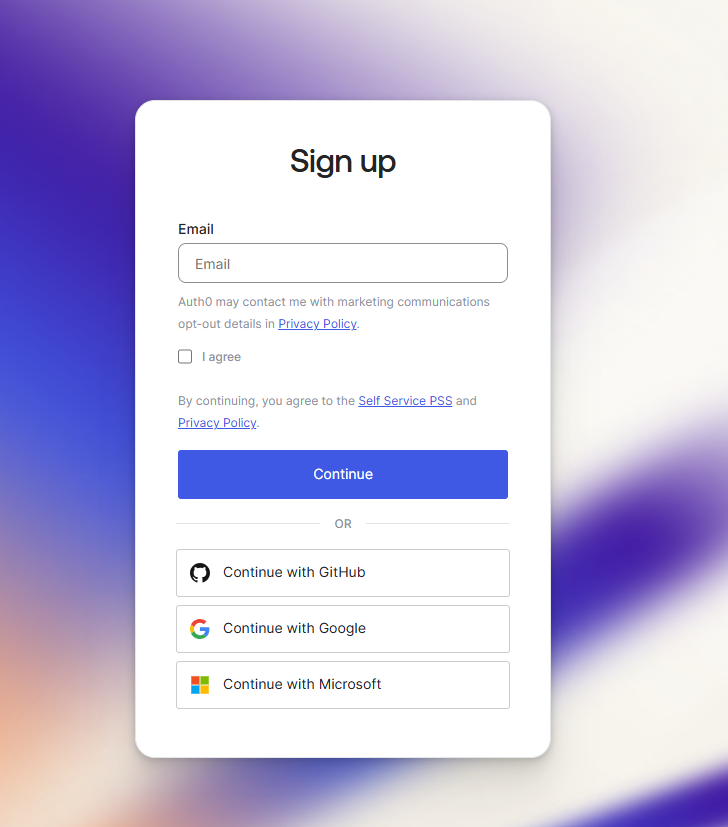
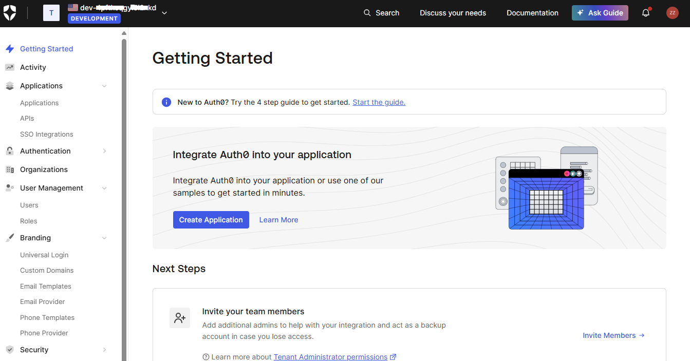
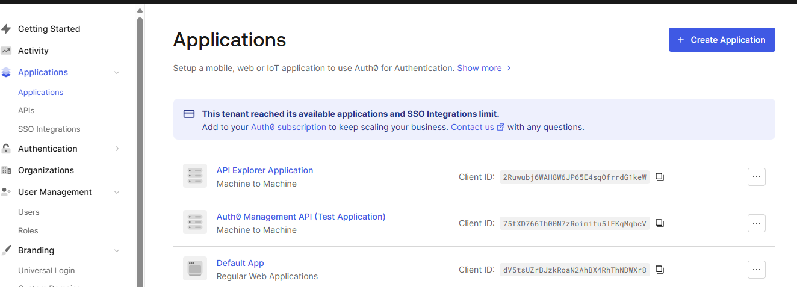
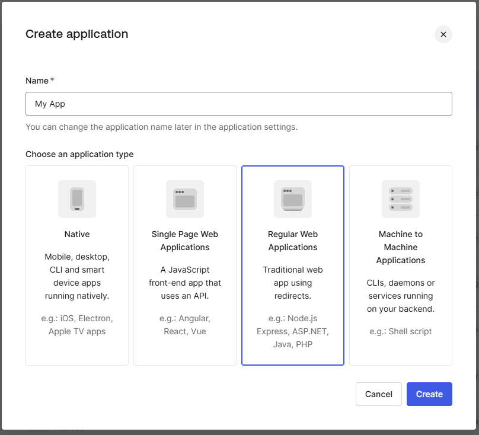
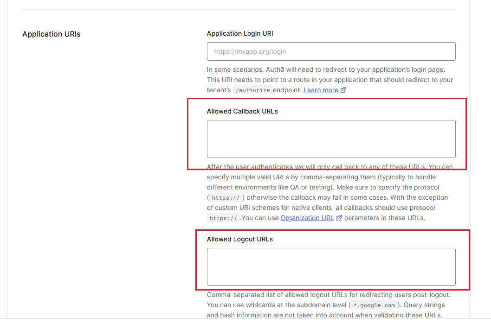
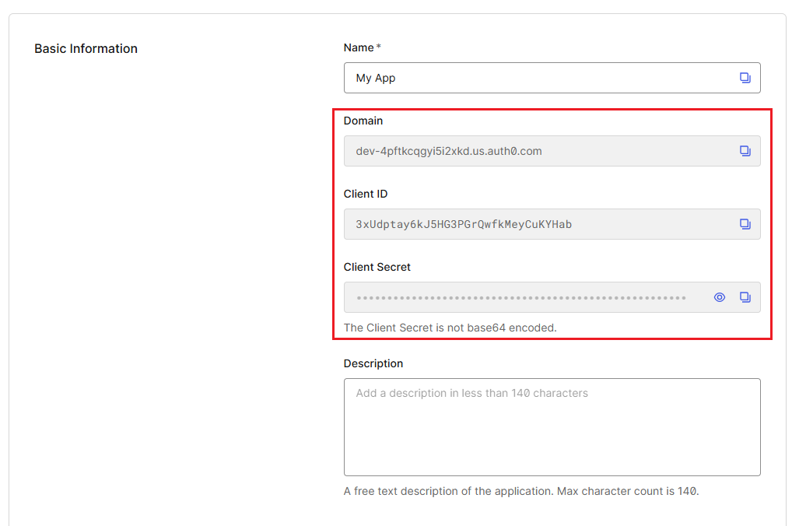
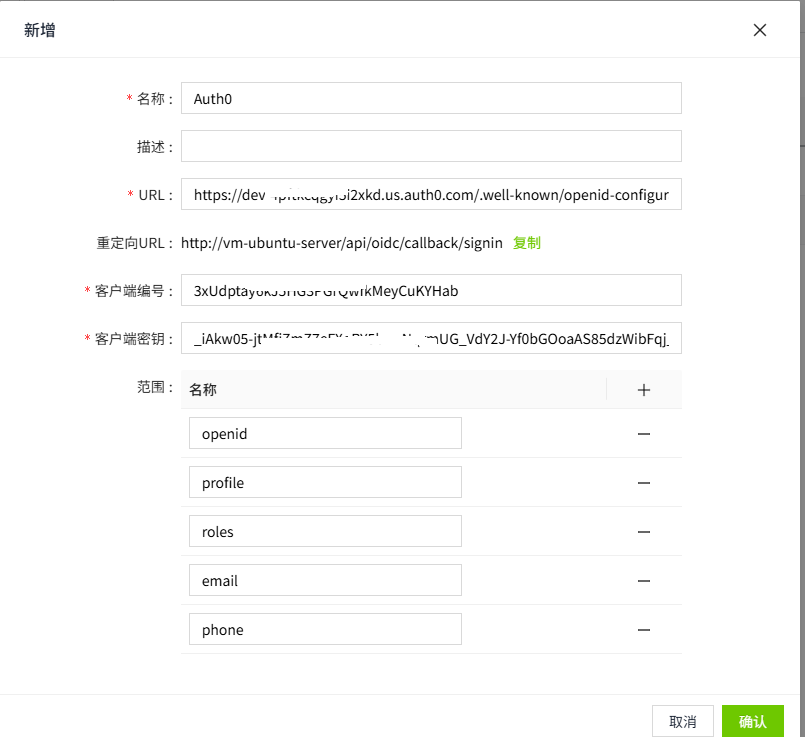

# 集成Auth0

Auth0是一个灵活、即插即用的解决方案，可为Web应用程序和移动应用程序添加身份验证与授权服务。该平台提供安全且可扩展的身份管理，支持多种身份提供商登录方式，包括：用户名/密码、社交账号登录（如Google、Facebook等）、企业级登录（如Active Directory、SAML协议）以及无密码验证选项。

WAGO SCADA 采用标准的 OpenID Connect 协议（OIDC），可与 Auth0 无缝集成。

1. 打开Auth0官方首页( [https://auth0.com/](https://auth0.com/) ), 点击 “Sign up” 按钮

    

2. 使用邮箱或者社交媒体账号注册Auth0账号

    

3. 完成注册并登录后，进入“Dashbaord”页面

    

4. 点击菜单 “Applications->Applications” 打开应用注册界面。

    

5. 点击按钮“**Create Application Button**”打开“**Create Application**”弹窗，此时有4个应用类型可以选择。WAGO SCADA采用了OIDC 协议中的Authorization Code Flow ， 这个flow对应的应用类型是“**Regular Web Applications**”

    

6. 点击“**Create**”按钮进入应用详情页面，在输入项“**Allowed Callback URLs**”和 “**Allowed Logout URLs**”中，输入WAGO SCADA的登入回调地址，和登出回调地址。 WAGO SCADA的登入回调地址分别是 **https://{SCADA-host}/api/oidc/callback/signin** 和**https://{SCADA-host}/api/oidc/callback/signout**.  

    

7. 复制应用详情页面中的 **Client ID**,**Client Secret** 和 **Domain。**

    

8. 打开SCADA系统的identty provider管理页面，点击“添加”按钮打开身份提供商创建表单，填写表单中的“客户ID”和“客户端密钥”字段。并在URL输入框中填入由上一步复制的域名与路径/.well-known/openid-configuration组成的网址。

    

9. 完成上述步骤后，就可以使用Auth0进行用户登录