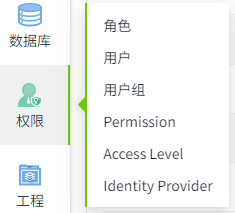
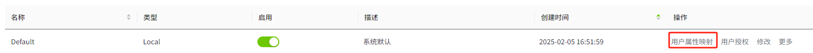
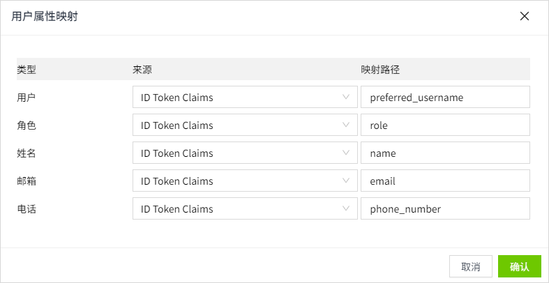
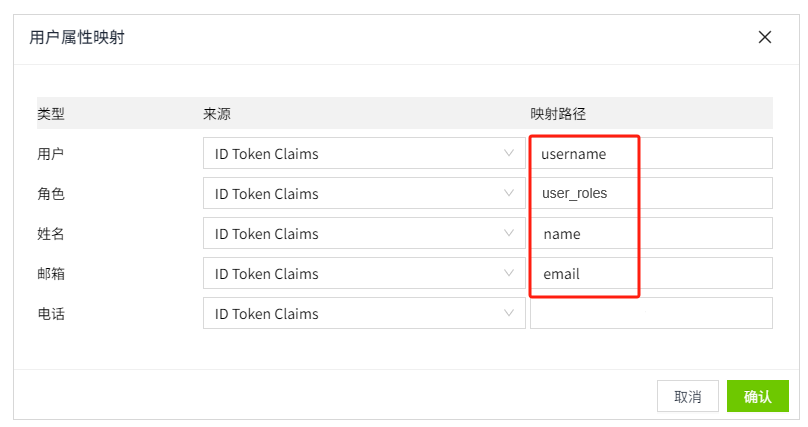

# 用户属性映射

用户属性映射允许您将Identity Provider响应文档中的信息映射到易于理解的属性。要正常工作，这要求WAGO SCADA已经具有有效的Identity Provider配置，该配置在尝试登录时返回响应文档。

## 配置用户属性映射

1. 点击“Security”->“Identity Provider”菜单。

      

2. 在Identity Provider列表的操作栏中，点击某一条数据的“用户属性映射“。

      

3. 在弹窗中设置映射来源和路径。系统内置了如下5个可用于映射的属性。

      

      **属性**

      | **名称** | **描述**  |
      |:----------|:------------|
      | 用户     | 用于用户名的映射  |
      | 角色     | 用于角色的映射  |
      | 姓名     | 用于姓名的映射 |
      | 邮箱     | 用于邮箱的映射   |
      | 电话     | 用于电话的映射  |
      | 来源     | 包含ID Token Claims，Token Endpoint Response，User Info Claims。  - ID Token Claims：ID 令牌声明，用于表示用户的身份信息。 - Token Endpoint Response：令牌端点响应。通常包含 Access Token、ID Token 和 Refresh Token。 - User Info Claims：用户信息声明。包含用户的详细属性（如姓名、邮箱、头像等）。 |
      | 映射路径 | 通常用于将Identity Provider返回的用户信息映射到本地系统的用户模型，确保应用程序能够正确识别和授权用户。 |

4. 点击“确认”按钮，完成设置。

**示例**

1. 假定Identity Provider返回的 **ID Token** 包含如下信息：

      {

      "username": "alex",

      "email": `alex@example.com`,

      "user_roles": "admin"

      "name": "张三"

      }

2. 映射路径可以设置为：

      

      - `username` → **本地用户名（username）**
      - `email` → **本地用户邮箱（email）**
      - `user_roles` → **本地用户角色（role）**
      - `name` → **本地用户姓名（name）**

3. 在WAGO SCADA中，最终用户信息被映射为：

      {

      "username": "alex",

      "email": `alex@example.com`,

      "role": "admin"

      "name": "张三"

      }