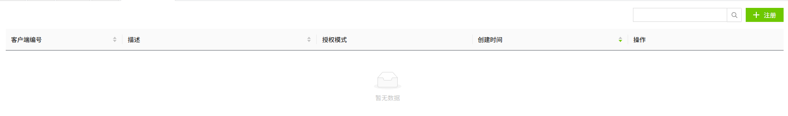
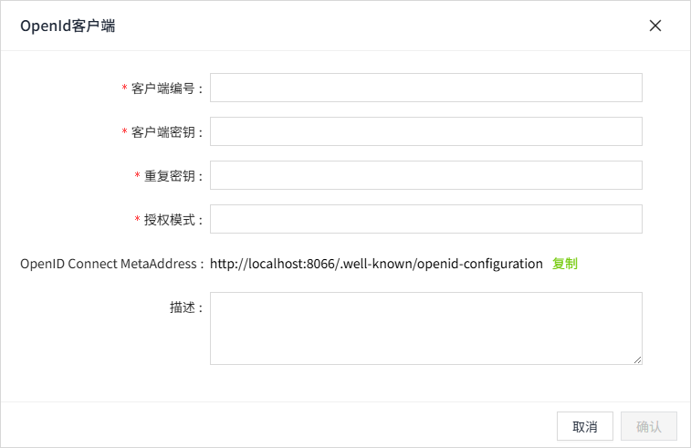
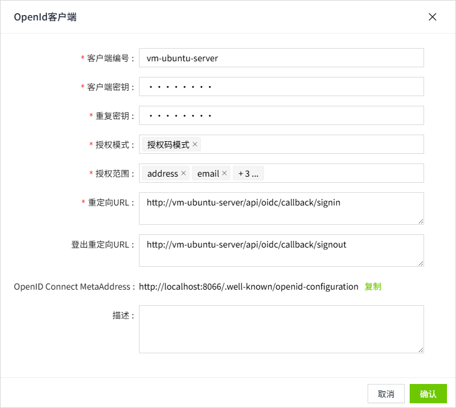
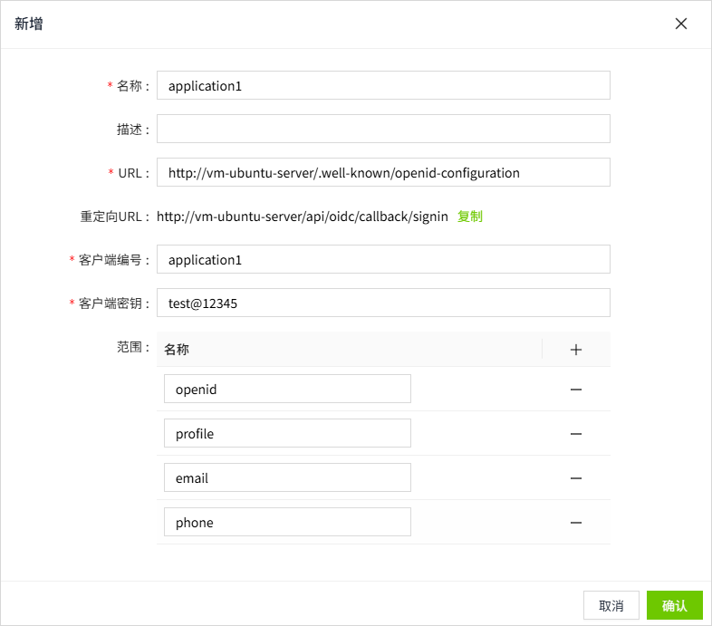
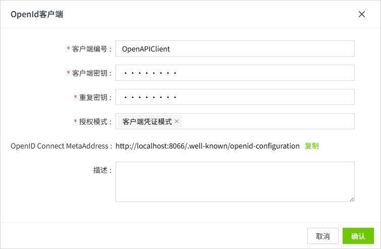
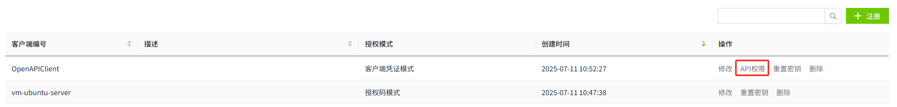
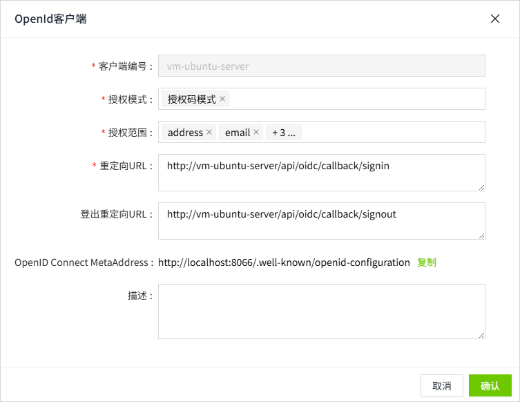
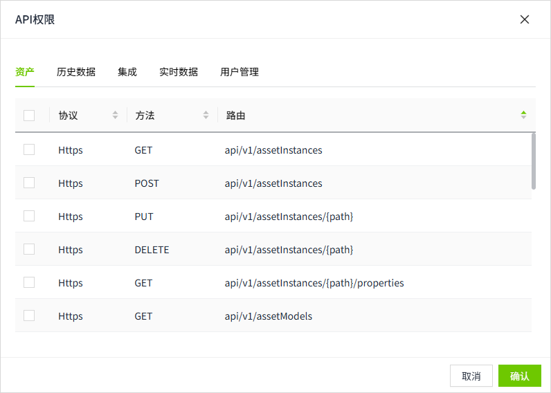
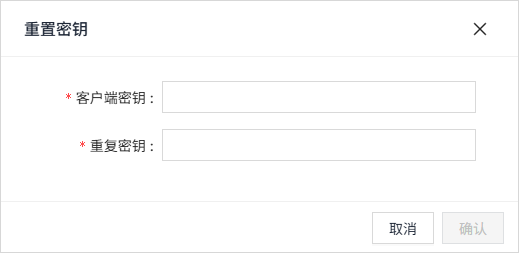
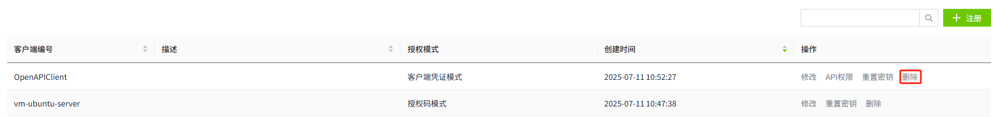

# OpenID Connect客户端

WAGO SCADA 内置 OpenID Connect (OIDC) 身份认证服务器，采用行业标准 OIDC 协议对用户进行认证。OIDC 服务器支持多种协议流程，适用于不同类型的应用程序：

- **授权码模式（Authorization Code Flow）**：适用于 Web 应用程序（服务端应用）。
- **隐式模式（Implicit Flow）**：适用于单页应用（SPA）和移动应用程序。
- **客户端凭证模式（Client Credentials Flow）**：适用于机器对机器（M2M）通信，无需用户交互。
- **刷新令牌模式（Refresh Token Flow）**：用于第三方应用程序刷新访问令牌，可与其他模式（除客户端凭证模式外）配合使用。

点击菜单"**权限**"-> "**OpenId 客户端**"，显示OIDC 客户端程序注册管理界面。

## 新增

点击“注册”按钮，添加Open ID客户端。

**属性**

| **名称**  | **描述**  |
|:----------------------|:---------------------|
| 客户端编号                 | API授权的客户端编号   |
| 客户端密钥                 | API授权的客户端密钥   |
| 重复密钥                   | 用于确认用户二次输入的密钥与第一次的密钥一致   |
| 授权模式                   | OIDC授权模式，包括授权码模式，客户端凭据模式，隐式模式，刷新令牌模式。支持多选。当选择客户端凭据模式时，需要设置需要的API，当选择其他三种模式时，无需设置API。 |
| 授权范围                   | 用户信息的范围。范围包括：address,email,phone,profile,roles |
| 重定向URL                  | 登录 SCADA OIDC 登录页面时，用户将被重定向到该URL。 |
| 登出重定向URL              | 当用户从 SCADA OIDC 端点注销时，用户将被重定向到该 URL。|
| OpenID Connect MetaAddress | 用于自动发现身份提供方（Identity Provider, IdP）配置的一个 URL。 |
| 描述                       | API授权的描述   |

**说明**：当注册一个新的OIDC客户端时，需要根据客户端应用程序的类型填写注册信息。

#### 场景1：一个客户端应用程序配置为使用SCADA作为其身份认证提供方（Identity Provider），以对终端用户进行身份验证

1. 注册一个OpenId 客户端。授权模式选择 **授权码模式（Authorization Code Flow）或隐式模式（Implicit Flow)**，**推荐使用授权码模式**。
2. 配置重定向地址

     - **重定向URL（Redirect URL)，示例（以SCADA系统为例）：** http://{客户端应用主机地址}/api/oidc/callback/signin
     - **登出重定向URL（Logout Redirect URL），示例（以SCADA系统为例）：** http://{客户端应用主机地址}/api/oidc/callback/signout

     

3. 打开客户端应用程序的 **Identity Provider** 配置界面，输入客户端 ID、客户端密钥。

     以 SCADA 作为客户端应用的示例，应将前面注册的客户端应用信息填写到身份提供者页面中。

     

#### 场景2：客户端应用程序通过其后端发起OPEN API请求，与WAGO SCADA系统进行交互

1. 在注册OpenId 客户端时，应仅选择“客户端凭证模式（Client Credential）”这一授权类型。客户端应用程序可通过客户端ID（client id）和客户端密钥（client secret）来请求访问令牌（access token）。

     

2. 客户端应用程序注册后，点击“API权限”按钮，配置第三方应用程序可使用该凭证调用的API范围。

     

     点击“API权限”按钮后，弹出权限窗口，选择所需权限。

     

## 修改

API授权创建后，可以点击"修改"按钮，修改API授权。

## API权限

点击"API权限"按钮可以设置这个API授权的所有的API调用权限。

## 重置密钥

点击“重置密钥”按钮可以将API授权的密钥重置。

## 删除

点击“删除”按钮可以删除该条API授权。删除后无法再使用此授权访问WAGO SCADA的接口数据。

## 安全建议

鉴于这些授权流程的使用场景和安全性考量的差异，我们强烈建议仅根据您的特定应用需求注册支持单一授权流程的客户端。请避免注册同时支持多种流程的客户端。

**原因**：在同一个客户端中支持多种流程可能导致安全风险或配置冲突。例如，通过客户端凭据获得的令牌可能绕过用户认证，从而引入授权漏洞。

**最佳实践：**

- 如果您的应用是面向终端用户交互的，请选择 **Authorization Code Flow（授权码模式）**。
- 如果您的应用是为服务器与服务器之间通信设计的(比如集成OpenAPI)，请选择 **Client Credential Flow（客户端凭据模式）**。SCADA 的Open API 被设计用于服务器之间的通信，因为其 API 权限绑定到客户端 ID。

通过选择合适的授权流程，您可以提高客户端的安全性，并确保您的应用符合最佳实践要求。

